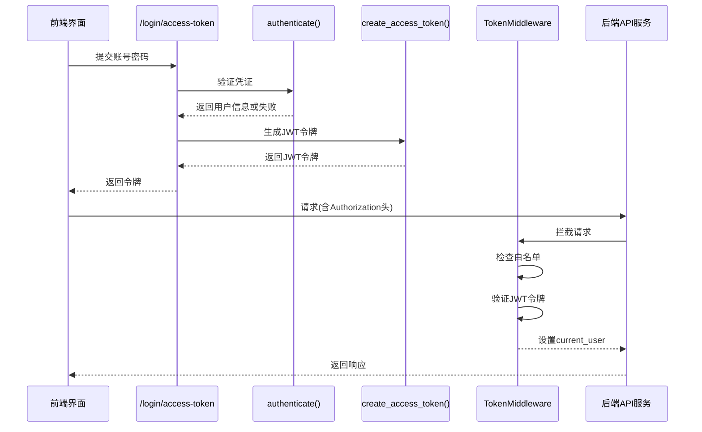
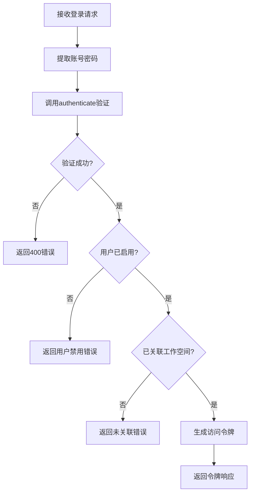
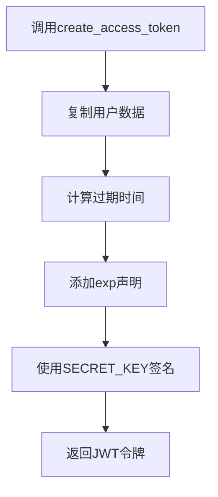
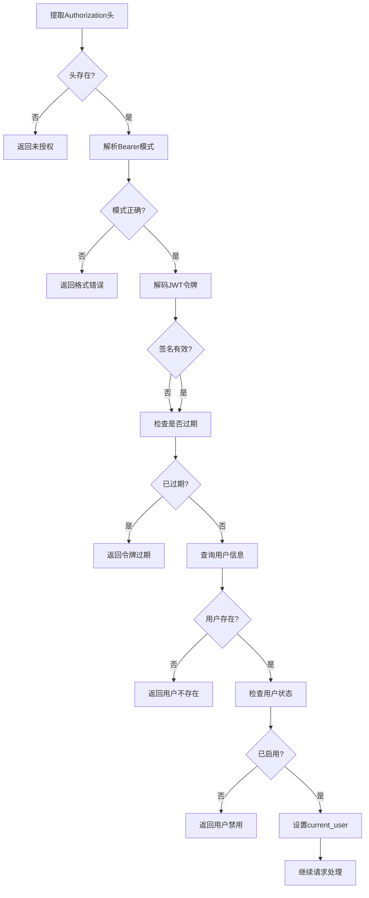
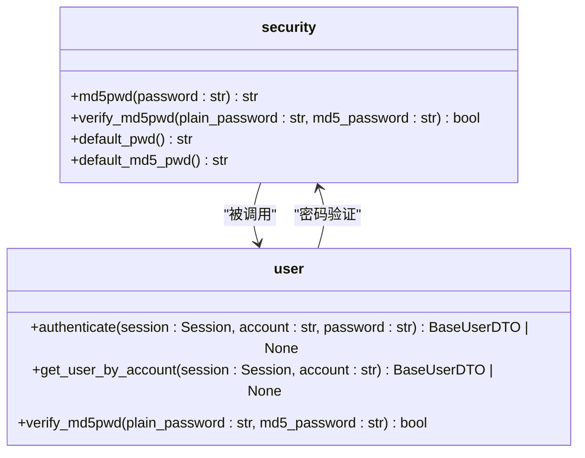
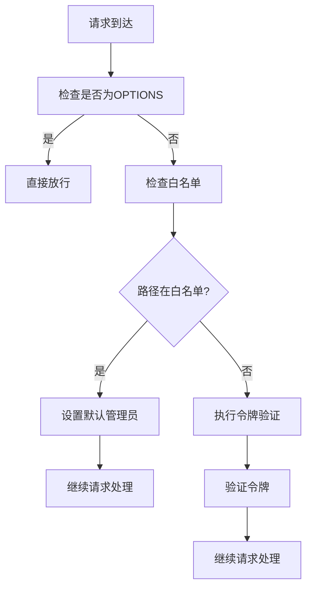
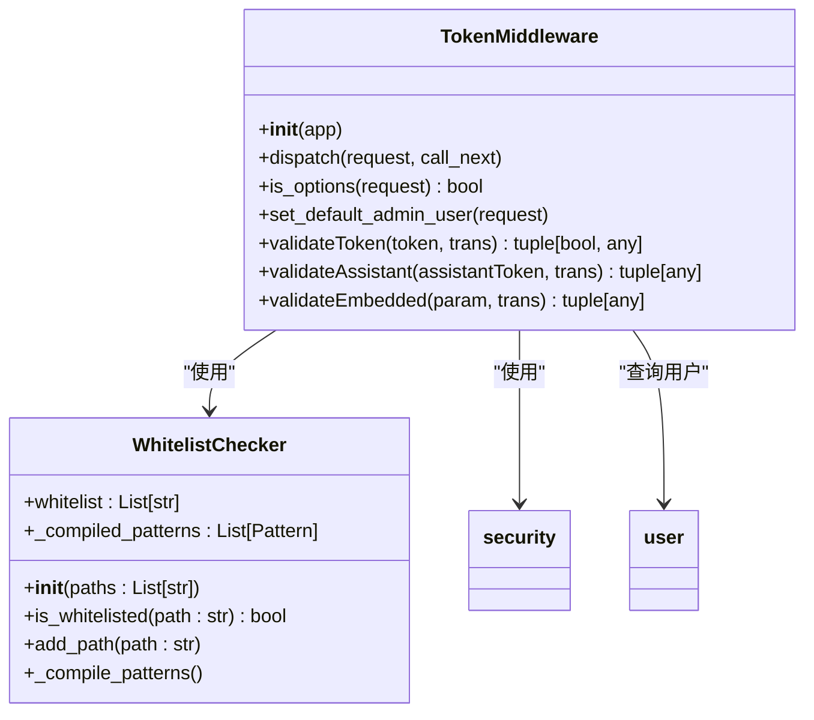
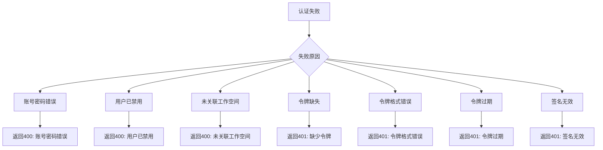
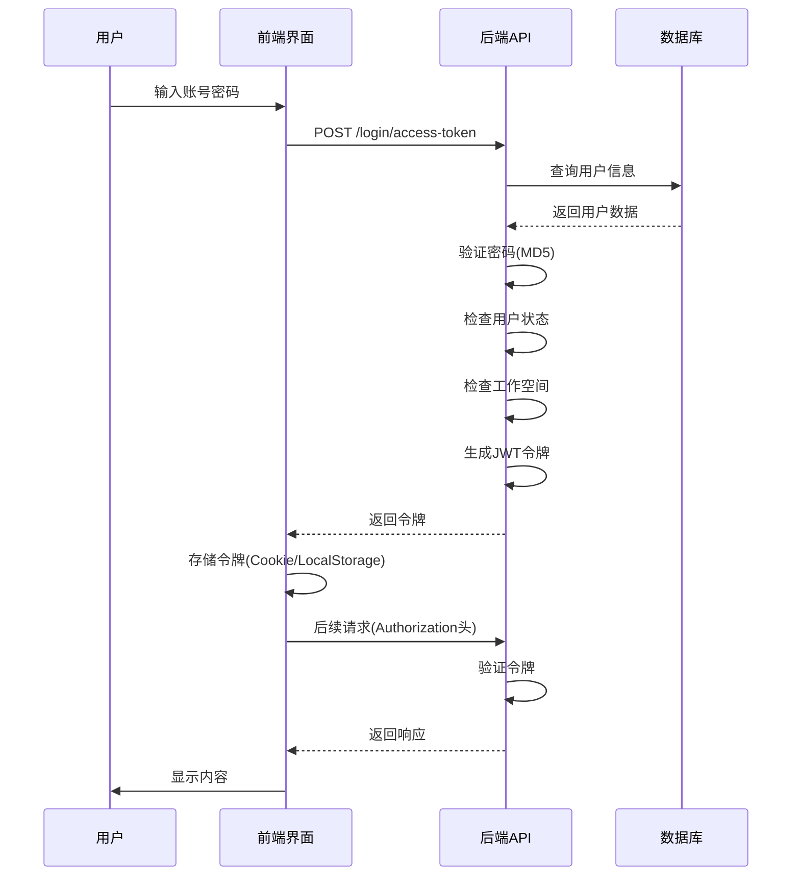

# 身份认证

<cite>
**本文档中引用的文件**  
- [login.py](file://backend/apps/system/api/login.py)
- [auth.py](file://backend/apps/system/middleware/auth.py)
- [security.py](file://backend/common/core/security.py)
- [user.py](file://backend/apps/system/crud/user.py)
- [whitelist.py](file://backend/common/utils/whitelist.py)
</cite>

## 目录
1. [简介](#简介)
2. [核心认证流程](#核心认证流程)
3. [登录接口实现](#登录接口实现)
4. [JWT令牌机制](#jwt令牌机制)
5. [密码安全机制](#密码安全机制)
6. [白名单机制](#白名单机制)
7. [认证中间件](#认证中间件)
8. [API调用示例](#api调用示例)
9. [错误处理](#错误处理)
10. [前端交互流程](#前端交互流程)

## 简介
本系统实现了基于JWT（JSON Web Token）的身份认证机制，为用户提供安全可靠的登录和访问控制功能。认证系统主要由登录接口、JWT令牌管理、密码安全存储、白名单免认证访问和中间件拦截验证等组件构成。系统采用MD5加密算法存储用户密码，并通过OAuth2PasswordRequestForm处理登录凭证。认证中间件负责拦截请求并验证令牌有效性，同时为特定路径提供免认证访问的白名单机制。

## 核心认证流程


**Diagram sources**  
- [login.py](file://backend/apps/system/api/login.py#L15-L34)
- [auth.py](file://backend/apps/system/middleware/auth.py#L20-L198)
- [security.py](file://backend/common/core/security.py#L14-L20)

**Section sources**
- [login.py](file://backend/apps/system/api/login.py#L1-L34)
- [auth.py](file://backend/apps/system/middleware/auth.py#L1-L198)

## 登录接口实现
系统通过`/login/access-token`接口处理用户登录请求，该接口使用FastAPI的OAuth2PasswordRequestForm来接收和处理凭证。登录流程包括账号密码验证、用户状态检查和工作空间关联验证。成功认证后，系统生成JWT访问令牌并返回给客户端。



**Diagram sources**  
- [login.py](file://backend/apps/system/api/login.py#L15-L34)
- [user.py](file://backend/apps/system/crud/user.py#L38-L44)

**Section sources**
- [login.py](file://backend/apps/system/api/login.py#L15-L34)

## JWT令牌机制
系统采用JWT标准实现无状态认证，令牌包含用户信息和过期时间。令牌的生成、验证和刷新流程确保了系统的安全性和可扩展性。

### 令牌生成


### 令牌验证


**Diagram sources**  
- [security.py](file://backend/common/core/security.py#L14-L20)
- [auth.py](file://backend/apps/system/middleware/auth.py#L100-L130)

**Section sources**
- [security.py](file://backend/common/core/security.py#L14-L20)
- [auth.py](file://backend/apps/system/middleware/auth.py#L100-L130)

## 密码安全机制
系统采用MD5哈希算法存储用户密码，确保密码数据的安全性。通过专门的验证函数检查用户输入的密码与存储的哈希值是否匹配。



**Diagram sources**  
- [security.py](file://backend/common/core/security.py#L35-L36)
- [user.py](file://backend/apps/system/crud/user.py#L38-L44)

**Section sources**
- [security.py](file://backend/common/core/security.py#L35-L36)
- [user.py](file://backend/apps/system/crud/user.py#L38-L44)

## 白名单机制
系统实现了灵活的白名单机制，允许特定路径无需认证即可访问。白名单配置支持通配符和正则表达式匹配，为静态资源和公共API提供便利。



**Diagram sources**  
- [whitelist.py](file://backend/common/utils/whitelist.py#L1-L82)
- [auth.py](file://backend/apps/system/middleware/auth.py#L35-L45)

**Section sources**
- [whitelist.py](file://backend/common/utils/whitelist.py#L1-L82)
- [auth.py](file://backend/apps/system/middleware/auth.py#L35-L45)

## 认证中间件
TokenMiddleware是系统的核心认证组件，负责拦截所有请求并执行认证逻辑。中间件首先检查请求路径是否在白名单中，然后根据请求头中的令牌类型执行相应的验证流程。



**Diagram sources**  
- [auth.py](file://backend/apps/system/middleware/auth.py#L20-L198)
- [whitelist.py](file://backend/common/utils/whitelist.py#L10-L75)

**Section sources**
- [auth.py](file://backend/apps/system/middleware/auth.py#L20-L198)

## API调用示例
以下是使用curl命令进行认证的API调用示例：

```bash
# 登录获取令牌
curl -X POST "http://localhost:8000/api/v1/login/access-token" \
  -H "Content-Type: application/x-www-form-urlencoded" \
  -d "username=admin" \
  -d "password=admin"

# 使用令牌访问受保护的API
curl -X GET "http://localhost:8000/api/v1/system/user" \
  -H "Authorization: Bearer <your-jwt-token>"
```

## 错误处理
系统实现了全面的错误处理机制，针对不同的认证失败场景返回相应的错误信息：



**Section sources**
- [login.py](file://backend/apps/system/api/login.py#L20-L34)
- [auth.py](file://backend/apps/system/middleware/auth.py#L100-L130)

## 前端交互流程
前端登录界面与后端API的完整交互流程如下：



**Diagram sources**  
- [login.py](file://backend/apps/system/api/login.py#L15-L34)
- [auth.py](file://backend/apps/system/middleware/auth.py#L20-L198)

**Section sources**
- [login.py](file://backend/apps/system/api/login.py#L15-L34)
- [auth.py](file://backend/apps/system/middleware/auth.py#L20-L198)