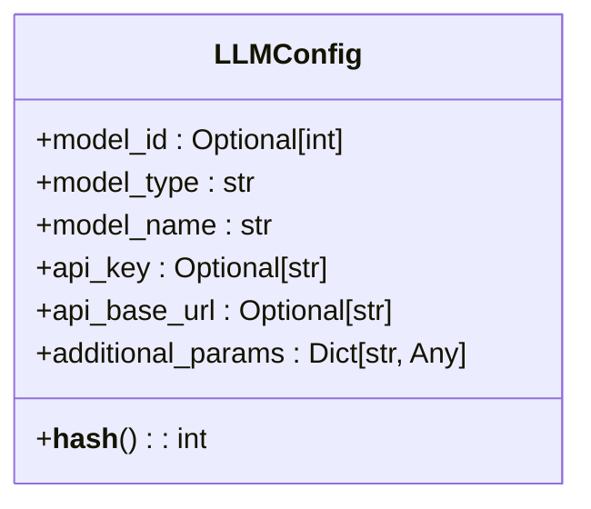
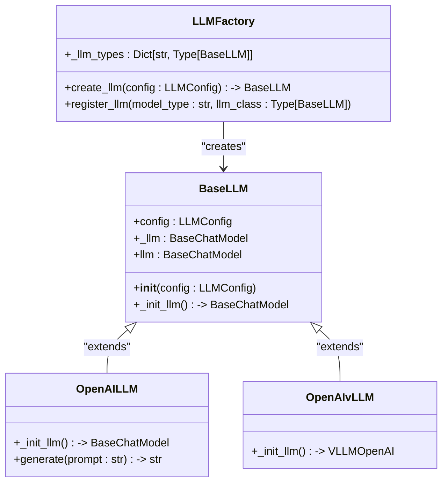
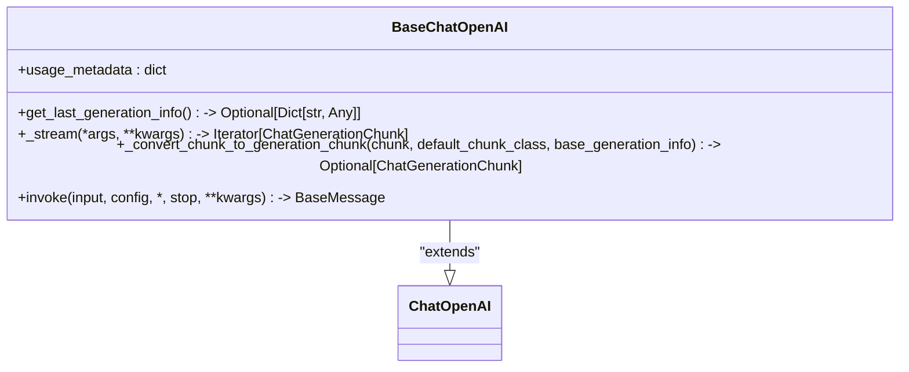
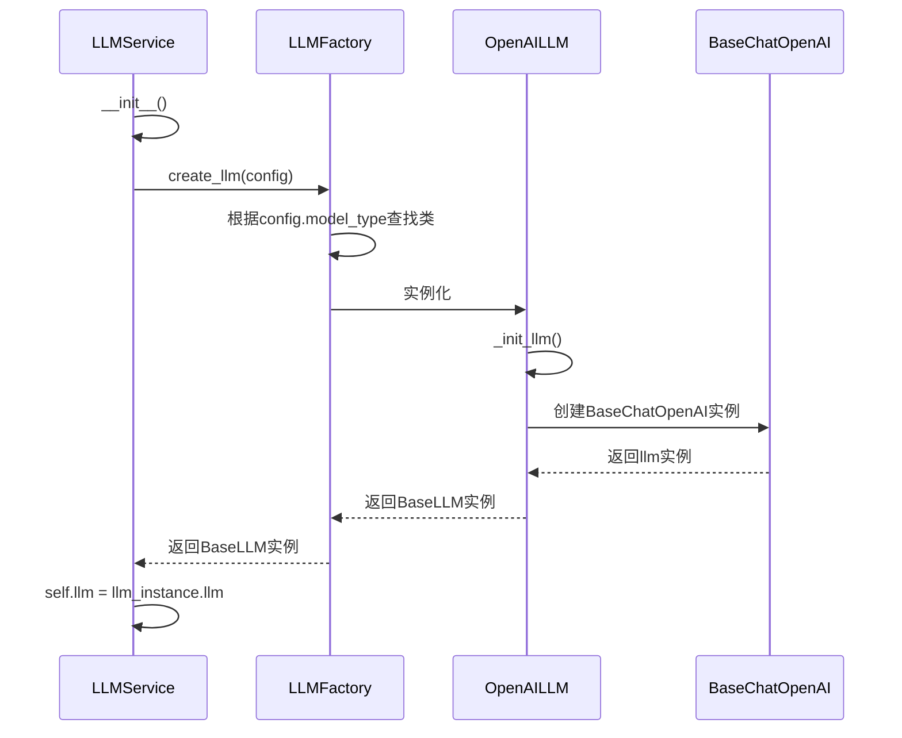
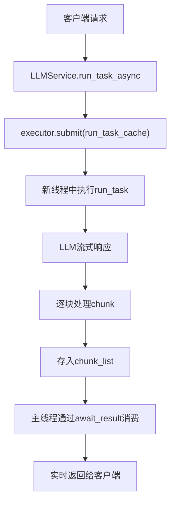
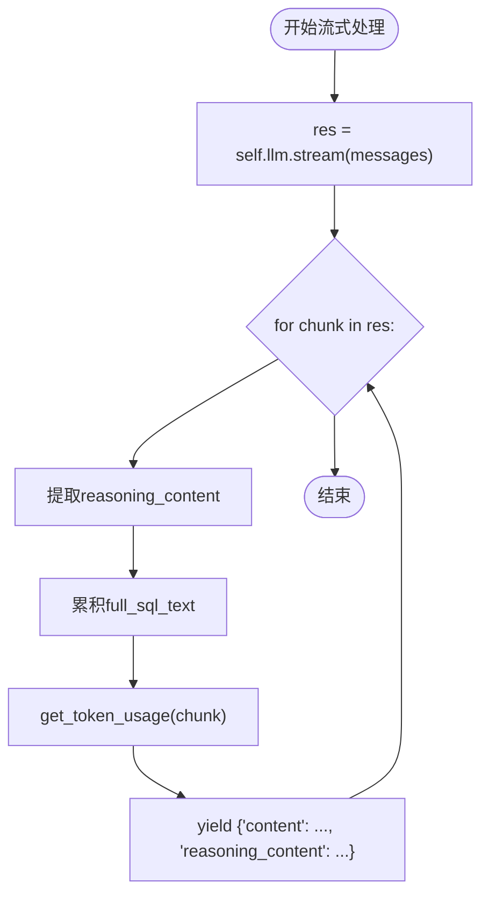
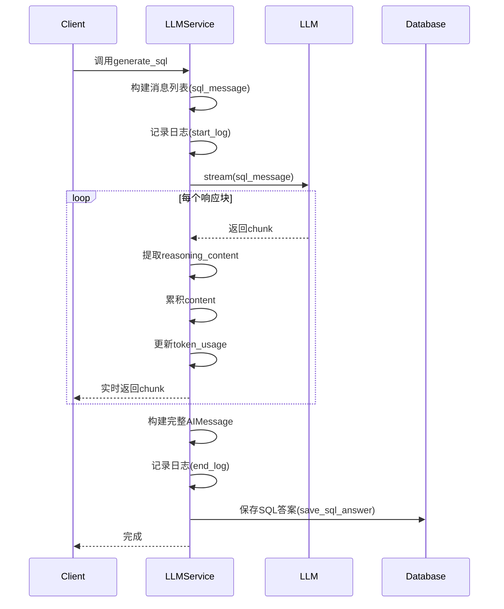
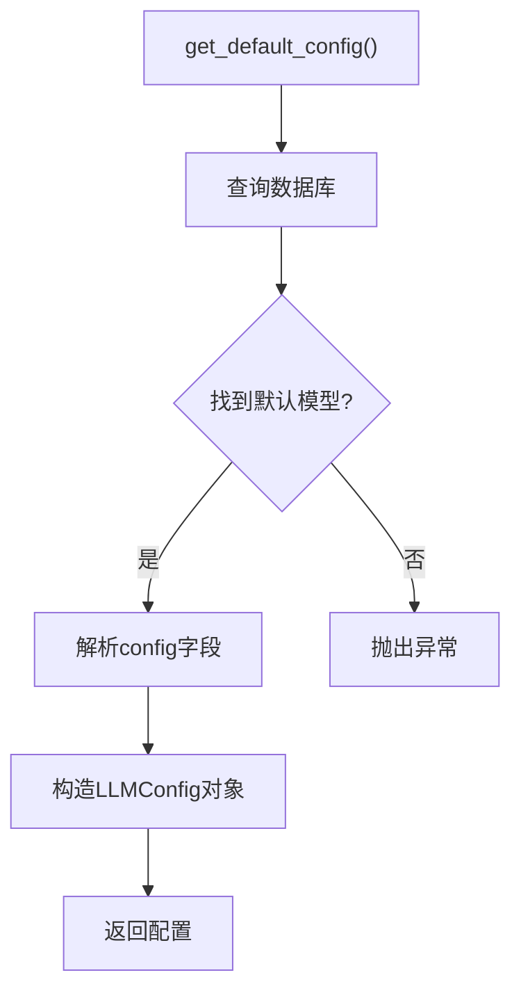

# LLM调用机制

<cite>
**Referenced Files in This Document**   
- [llm.py](file://backend/apps/ai_model/openai/llm.py)
- [model_factory.py](file://backend/apps/ai_model/model_factory.py)
- [llm.py](file://backend/apps/chat/task/llm.py)
</cite>

## Table of Contents
1. [LLM调用机制概述](#llm调用机制概述)
2. [核心组件分析](#核心组件分析)
3. [LLMFactory与LLMService的交互](#llmfactory与llmservice的交互)
4. [流式响应实现机制](#流式响应实现机制)
5. [generate_sql方法生命周期](#generatesql方法生命周期)
6. [配置传递与参数管理](#配置传递与参数管理)
7. [响应处理与数据提取](#响应处理与数据提取)
8. [错误处理与性能优化](#错误处理与性能优化)

## LLM调用机制概述

本技术文档详细阐述了SQLBot系统中LLM（大语言模型）的调用机制。系统通过`LLMFactory`工厂类创建和管理LLM实例，并由`LLMService`服务类协调整个调用流程。核心机制包括：通过`LLMConfig`配置对象传递模型参数，利用`ThreadPoolExecutor`实现异步任务调度，以及通过流式响应（streaming）处理大模型返回的逐块数据。该机制支持从消息构建、模型调用到结果处理的完整生命周期管理。

**Section sources**
- [model_factory.py](file://backend/apps/ai_model/model_factory.py#L17-L42)
- [llm.py](file://backend/apps/chat/task/llm.py#L47-L1112)

## 核心组件分析

### LLMConfig配置类

`LLMConfig`是系统中用于配置大语言模型的核心数据结构。它定义了模型实例化所需的所有参数，包括模型ID、类型、名称、API密钥、基础URL以及额外的参数配置。该类继承自Pydantic的`BaseModel`，并设置了`frozen = True`以确保配置的不可变性。为了支持在缓存中使用，该类实现了`__hash__`方法，将所有字段（包括嵌套的字典）转换为可哈希的元组。

**Diagram sources**
- [model_factory.py](file://backend/apps/ai_model/model_factory.py#L17-L42)

### LLMFactory工厂类

`LLMFactory`是负责创建和管理LLM实例的工厂类。它维护一个`_llm_types`字典，将模型类型（如"openai", "vllm"）映射到具体的实现类（如`OpenAILLM`, `OpenAIvLLM`）。`create_llm`方法是其核心，它接收一个`LLMConfig`对象，根据配置中的`model_type`查找对应的类，然后实例化并返回。该方法使用`@lru_cache`装饰器进行缓存，以提高性能。

**Diagram sources**
- [model_factory.py](file://backend/apps/ai_model/model_factory.py#L48-L50)
- [model_factory.py](file://backend/apps/ai_model/model_factory.py#L85-L105)

### BaseChatOpenAI扩展类

`BaseChatOpenAI`是`langchain_openai`库中`ChatOpenAI`类的扩展。它重写了`_stream`方法，以支持流式响应和使用量统计。关键特性包括：
- `usage_metadata`字段：用于存储从流式响应中提取的token使用量信息。
- `_stream`方法：在调用父类的流式方法时，设置`stream_usage=True`，并捕获每个`chunk`中的`usage_metadata`。
- `invoke`方法：在同步调用后，从响应中提取token使用量信息并更新`usage_metadata`。

**Diagram sources**
- [llm.py](file://backend/apps/ai_model/openai/llm.py#L72-L166)

## LLMFactory与LLMService的交互

`LLMService`是协调LLM调用的核心服务类。在其初始化过程中，它通过`LLMFactory`创建具体的LLM实例。

**Diagram sources**
- [llm.py](file://backend/apps/chat/task/llm.py#L70-L126)
- [model_factory.py](file://backend/apps/ai_model/model_factory.py#L85-L105)

**Section sources**
- [llm.py](file://backend/apps/chat/task/llm.py#L70-L126)
- [model_factory.py](file://backend/apps/ai_model/model_factory.py#L85-L105)

## 流式响应实现机制

系统通过`ThreadPoolExecutor`和生成器（generator）实现高效的流式响应处理。

### 异步任务调度

`LLMService`使用一个全局的`ThreadPoolExecutor`来管理异步任务。`run_task_async`方法将`run_task_cache`提交到线程池中执行，从而非阻塞地处理LLM调用。

**Diagram sources**
- [llm.py](file://backend/apps/chat/task/llm.py#L838-L850)
- [llm.py](file://backend/apps/chat/task/llm.py#L855-L857)

### Chunk数据处理

当LLM返回流式响应时，`LLMService`会迭代处理每一个`chunk`。对于`generate_sql`等方法，它会：
1. 调用`self.llm.stream(messages)`获取一个生成器。
2. 遍历生成器中的每个`chunk`。
3. 从`chunk`的`additional_kwargs`中提取`reasoning_content`（如思维链）。
4. 累积`chunk.content`以构建完整响应。
5. 调用`get_token_usage`函数更新token使用量统计。
6. 通过`yield`将处理后的数据块实时返回。

**Diagram sources**
- [llm.py](file://backend/apps/chat/task/llm.py#L492-L532)
- [llm.py](file://backend/apps/chat/task/llm.py#L1176-L1183)

**Section sources**
- [llm.py](file://backend/apps/chat/task/llm.py#L492-L532)

## generate_sql方法生命周期

`generate_sql`方法展示了从消息构建到响应处理的完整生命周期。

**Diagram sources**
- [llm.py](file://backend/apps/chat/task/llm.py#L492-L532)

**Section sources**
- [llm.py](file://backend/apps/chat/task/llm.py#L492-L532)

## 配置传递与参数管理

系统的配置管理遵循清晰的层次结构。

### 配置加载流程

`get_default_config`函数负责从数据库加载默认的LLM配置。它查询`AiModelDetail`表，获取标记为默认模型的记录，并将其属性映射到`LLMConfig`对象。

**Diagram sources**
- [model_factory.py](file://backend/apps/ai_model/model_factory.py#L120-L144)

### 额外参数传递

`additional_params`字段用于传递模型特定的参数，如`temperature`、`max_tokens`等。这些参数通过`**kwargs`的方式传递给底层的`langchain`模型构造函数。特别地，`extra_body`参数可用于向API请求体中添加自定义字段，例如`enable_thinking`来控制Qwen模型的思维链输出。

**Section sources**
- [model_factory.py](file://backend/apps/ai_model/model_factory.py#L120-L144)
- [llm.py](file://backend/apps/chat/task/llm.py#L70-L126)

## 响应处理与数据提取

系统提供了专门的函数来处理和提取LLM响应中的关键信息。

### Reasoning Content处理

在`generate_sql`等方法中，通过检查`chunk.additional_kwargs`字典来提取`reasoning_content`。这个字段通常包含模型的思维过程或推理步骤，可以用于向用户展示模型的思考过程。

### Token Usage统计

`get_token_usage`函数负责从`chunk`中提取token使用量信息。它检查`chunk.usage_metadata`是否存在，并将`input_tokens`、`output_tokens`和`total_tokens`更新到一个共享的`token_usage`字典中，以便在调用结束后进行记录。

**Section sources**
- [llm.py](file://backend/apps/chat/task/llm.py#L492-L532)
- [llm.py](file://backend/apps/chat/task/llm.py#L1176-L1183)

## 错误处理与性能优化

### 错误处理机制

系统实现了多层次的错误处理：
- **超时控制**：`is_running`方法使用`concurrent.futures.wait`配合超时参数来检查任务是否仍在运行。
- **异常捕获**：`run_task`等核心方法使用`try-except`块捕获所有异常，并通过`save_error`方法将错误信息持久化。
- **输入验证**：`check_sql`等方法对LLM的输出进行严格验证，确保其符合预期格式。

### 性能优化策略

- **连接池**：通过`create_engine`创建的SQLAlchemy引擎内置了连接池。
- **请求批处理**：虽然当前代码未直接体现，但`ThreadPoolExecutor`的设计为未来的批处理优化提供了基础。
- **缓存**：`LLMFactory.create_llm`方法使用`lru_cache`缓存已创建的LLM实例，避免重复初始化的开销。

**Section sources**
- [llm.py](file://backend/apps/chat/task/llm.py#L128-L136)
- [llm.py](file://backend/apps/chat/task/llm.py#L859-L1017)
- [model_factory.py](file://backend/apps/ai_model/model_factory.py#L85-L105)