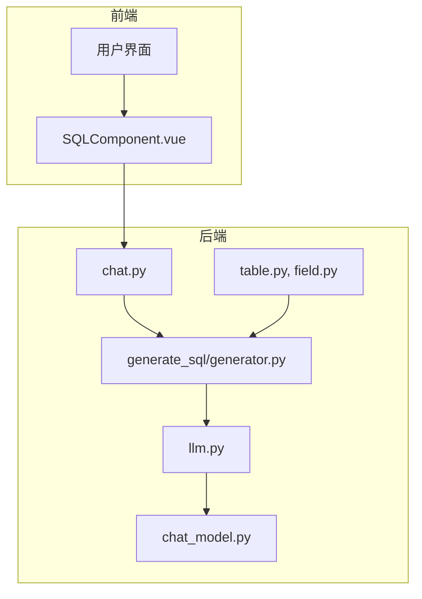
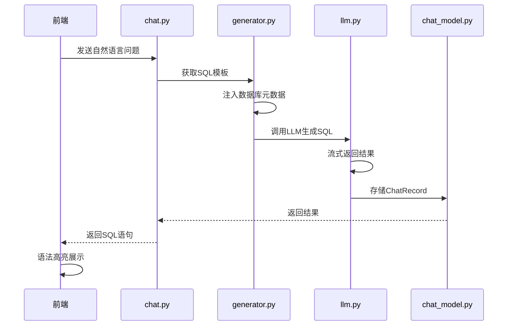
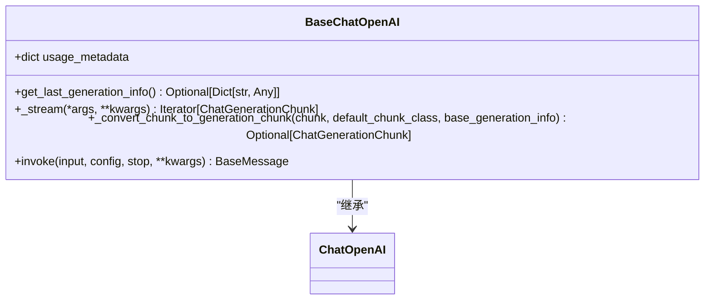
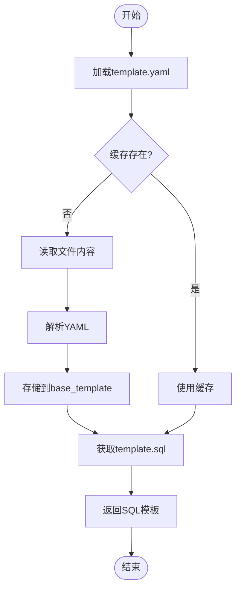
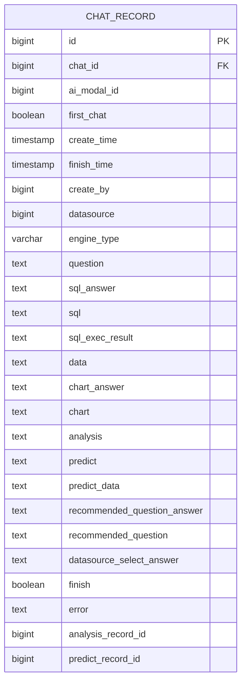
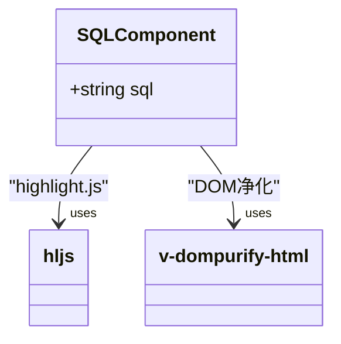
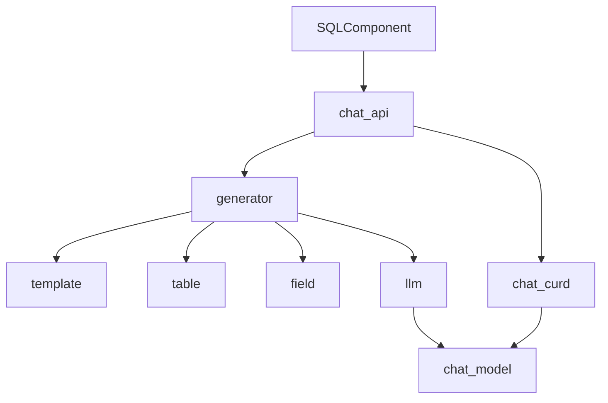

# SQL生成机制

<cite>
**本文档中引用的文件**
- [llm.py](file://backend/apps/ai_model/openai/llm.py)
- [chat_model.py](file://backend/apps/chat/models/chat_model.py)
- [SQLComponent.vue](file://frontend/src/views/chat/component/SQLComponent.vue)
- [generator.py](file://backend/apps/template/generate_sql/generator.py)
- [template.py](file://backend/apps/template/template.py)
- [chat.py](file://backend/apps/chat/api/chat.py)
- [chat.py](file://backend/apps/chat/curd/chat.py)
- [table.py](file://backend/apps/datasource/crud/table.py)
- [field.py](file://backend/apps/datasource/crud/field.py)
</cite>

## 目录
1. [简介](#简介)
2. [项目结构](#项目结构)
3. [核心组件](#核心组件)
4. [架构概述](#架构概述)
5. [详细组件分析](#详细组件分析)
6. [依赖分析](#依赖分析)
7. [性能考虑](#性能考虑)
8. [故障排除指南](#故障排除指南)
9. [结论](#结论)

## 简介
本文档全面阐述了SQLBot系统中自然语言到SQL查询的生成机制。该系统利用大型语言模型（LLM）将用户提出的自然语言问题转换为结构化SQL语句，支持流式响应、异步任务调度和前端语法高亮展示。文档深入分析了提示词工程设计、数据库元数据注入、语法约束处理和安全过滤等关键环节。

## 项目结构
SQLBot项目采用前后端分离架构，后端基于FastAPI构建，前端使用Vue3框架。SQL生成核心逻辑位于`backend/apps/template/generate_sql/generator.py`，LLM调用封装在`backend/apps/ai_model/openai/llm.py`，数据库模型定义在`backend/apps/chat/models/chat_model.py`，前端展示组件为`frontend/src/views/chat/component/SQLComponent.vue`。

**图示来源**
- [SQLComponent.vue](file://frontend/src/views/chat/component/SQLComponent.vue)
- [chat.py](file://backend/apps/chat/api/chat.py)
- [generator.py](file://backend/apps/template/generate_sql/generator.py)
- [llm.py](file://backend/apps/ai_model/openai/llm.py)
- [chat_model.py](file://backend/apps/chat/models/chat_model.py)
- [table.py](file://backend/apps/datasource/crud/table.py)
- [field.py](file://backend/apps/datasource/crud/field.py)

**本节来源**
- [SQLComponent.vue](file://frontend/src/views/chat/component/SQLComponent.vue)
- [chat.py](file://backend/apps/chat/api/chat.py)
- [generator.py](file://backend/apps/template/generate_sql/generator.py)

## 核心组件
系统核心组件包括LLM调用引擎、SQL模板生成器、聊天记录模型和前端SQL展示组件。`BaseChatOpenAI`类扩展了LangChain的ChatOpenAI，实现了流式响应和使用量统计。`ChatRecord`模型定义了SQL生成结果的存储结构，包含`sql`、`sql_answer`和`error`等关键字段。

**本节来源**
- [llm.py](file://backend/apps/ai_model/openai/llm.py#L72-L166)
- [chat_model.py](file://backend/apps/chat/models/chat_model.py#L76-L103)

## 架构概述
系统采用分层架构，从用户输入到SQL输出的完整流程为：前端接收自然语言问题 → 后端API路由 → 构建包含数据库元数据的提示词 → 调用LLM生成SQL → 存储结果 → 前端展示。提示词模板从`template.yaml`文件加载，包含系统角色和用户问题的格式化规则。

**图示来源**
- [chat.py](file://backend/apps/chat/api/chat.py)
- [generator.py](file://backend/apps/template/generate_sql/generator.py)
- [llm.py](file://backend/apps/ai_model/openai/llm.py)
- [chat_model.py](file://backend/apps/chat/models/chat_model.py)

## 详细组件分析

### LLM调用机制分析
`BaseChatOpenAI`类通过重写`_stream`和`_convert_chunk_to_generation_chunk`方法实现了流式响应处理。`_stream`方法设置`stream_usage=True`以获取使用量元数据，并在每次接收到数据块时更新`usage_metadata`字段。`invoke`方法用于同步调用，返回完整的BaseMessage对象。

**图示来源**
- [llm.py](file://backend/apps/ai_model/openai/llm.py#L72-L166)

**本节来源**
- [llm.py](file://backend/apps/ai_model/openai/llm.py#L72-L166)

### SQL模板生成分析
SQL模板通过`get_sql_template()`函数从`template.yaml`文件中加载。该函数调用`get_base_template()`获取基础模板，然后提取`template.sql`部分。模板包含系统消息和用户消息的格式化字符串，用于注入数据库引擎类型、模式信息和用户问题。

**图示来源**
- [generator.py](file://backend/apps/template/generate_sql/generator.py#L3-L5)
- [template.py](file://backend/apps/template/template.py)

**本节来源**
- [generator.py](file://backend/apps/template/generate_sql/generator.py#L3-L5)
- [template.py](file://backend/apps/template/template.py)

### 聊天记录模型分析
`ChatRecord`模型定义了SQL生成结果的持久化结构。关键字段包括`sql`（生成的SQL语句）、`sql_answer`（SQL执行结果的自然语言解释）和`error`（错误信息）。该模型还包含`first_chat`标志位和`finish`完成状态，用于跟踪会话进度。

**图示来源**
- [chat_model.py](file://backend/apps/chat/models/chat_model.py#L76-L103)

**本节来源**
- [chat_model.py](file://backend/apps/chat/models/chat_model.py#L76-L103)

### 前端SQL展示分析
`SQLComponent.vue`组件使用highlight.js对生成的SQL语句进行语法高亮。组件接收`sql`属性，通过`v-dompurify-html`指令安全地渲染高亮后的SQL代码。样式采用GitHub主题，提供良好的可读性。

**图示来源**
- [SQLComponent.vue](file://frontend/src/views/chat/component/SQLComponent.vue)

**本节来源**
- [SQLComponent.vue](file://frontend/src/views/chat/component/SQLComponent.vue)

## 依赖分析
系统各组件间存在明确的依赖关系。前端组件依赖API接口获取数据，API层依赖模板生成器和LLM服务，模板生成器需要数据库表结构和字段信息。`chat.py` API依赖`curd/chat.py`进行数据持久化操作。

**图示来源**
- [SQLComponent.vue](file://frontend/src/views/chat/component/SQLComponent.vue)
- [chat.py](file://backend/apps/chat/api/chat.py)
- [chat.py](file://backend/apps/chat/curd/chat.py)
- [generator.py](file://backend/apps/template/generate_sql/generator.py)
- [template.py](file://backend/apps/template/template.py)
- [table.py](file://backend/apps/datasource/crud/table.py)
- [field.py](file://backend/apps/datasource/crud/field.py)
- [llm.py](file://backend/apps/ai_model/openai/llm.py)
- [chat_model.py](file://backend/apps/chat/models/chat_model.py)

**本节来源**
- [SQLComponent.vue](file://frontend/src/views/chat/component/SQLComponent.vue)
- [chat.py](file://backend/apps/chat/api/chat.py)
- [chat.py](file://backend/apps/chat/curd/chat.py)
- [generator.py](file://backend/apps/template/generate_sql/generator.py)
- [template.py](file://backend/apps/template/template.py)
- [table.py](file://backend/apps/datasource/crud/table.py)
- [field.py](file://backend/apps/datasource/crud/field.py)
- [llm.py](file://backend/apps/ai_model/openai/llm.py)
- [chat_model.py](file://backend/apps/chat/models/chat_model.py)

## 性能考虑
系统通过多种机制优化性能：使用`base_template`全局缓存避免重复读取YAML文件；LLM调用支持流式响应减少用户等待时间；前端采用语法高亮提升可读性。建议实施查询模板缓存和错误重试机制以进一步提高系统稳定性。

## 故障排除指南
常见问题包括SQL生成错误和执行失败。诊断方法：检查`ChatRecord.error`字段获取错误详情；验证数据库连接和权限；确认提示词模板正确注入元数据。可通过重试机制和更详细的错误日志来改进问题定位。

**本节来源**
- [chat_model.py](file://backend/apps/chat/models/chat_model.py#L101)
- [llm.py](file://backend/apps/ai_model/openai/llm.py)

## 结论
SQLBot的SQL生成机制通过紧密结合LLM能力与结构化数据访问，实现了自然语言到SQL的高效转换。系统设计考虑了流式响应、错误处理和前端展示等完整用户体验，为数据分析提供了强大的自然语言接口。