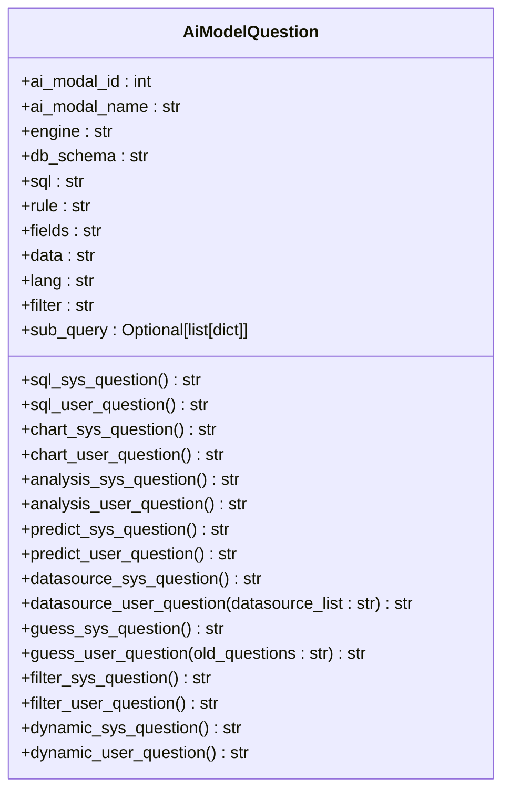
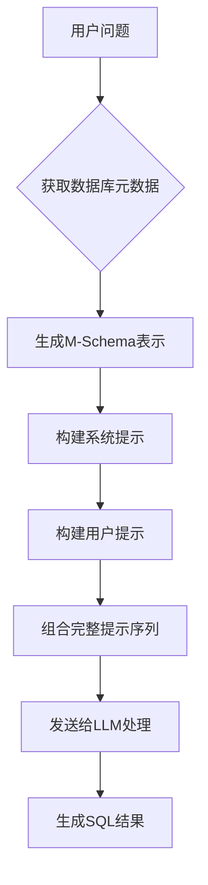

# 提示词工程

<cite>
**本文档引用文件**  
- [generator.py](file://backend/apps/template/generate_sql/generator.py)
- [chat_model.py](file://backend/apps/chat/models/chat_model.py)
- [template.py](file://backend/apps/template/template.py)
- [template.yaml](file://backend/template.yaml)
- [datasource.py](file://backend/apps/datasource/crud/datasource.py)
</cite>

## 目录
1. [引言](#引言)
2. [提示词模板设计原理](#提示词模板设计原理)
3. [提示词动态构建机制](#提示词动态构建机制)
4. [提示词示例与转换流程](#提示词示例与转换流程)
5. [数据库元数据在提示词中的作用](#数据库元数据在提示词中的作用)
6. [提示词设计最佳实践](#提示词设计最佳实践)
7. [结论](#结论)

## 引言
本技术文档深入分析SQL生成系统中的提示词工程实现机制。重点解析`generate_sql/generator.py`中SQL生成提示模板的设计原理，以及`chat_model.py`中`AiModelQuestion`类如何动态构建系统提示和用户提示。文档将详细说明提示词中包含的数据库元数据信息如何帮助大语言模型生成准确的SQL语句，并讨论提示词设计中的最佳实践。

## 提示词模板设计原理

提示词模板系统采用分层设计，通过YAML配置文件定义标准化的提示结构。系统提示（system prompt）和用户提示（user prompt）分别承担不同的角色：系统提示定义任务规范和输出格式，用户提示提供具体查询上下文。

模板通过`get_base_template()`函数从`template.yaml`文件加载，并由`get_sql_template()`函数提取SQL相关模板。这种设计实现了提示词内容与业务逻辑的解耦，便于维护和国际化。

**Section sources**
- [generator.py](file://backend/apps/template/generate_sql/generator.py#L3-L5)
- [template.py](file://backend/apps/template/template.py#L11-L14)
- [template.yaml](file://backend/template.yaml#L0-L255)

## 提示词动态构建机制

`AiModelQuestion`类作为提示词构建的核心，通过模板方法模式实现动态提示生成。该类定义了多个模板方法，如`sql_sys_question`和`sql_user_question`，用于构建不同场景下的提示词。

**Diagram sources**
- [chat_model.py](file://backend/apps/chat/models/chat_model.py#L160-L222)

### 参数在提示词中的作用

- **db_schema**: 提供数据库表结构信息，以M-Schema格式注入，包含表名、字段类型和描述
- **engine**: 指定数据库引擎类型，影响SQL语法和标识符引用方式
- **lang**: 控制输出语言，确保响应语言与用户偏好一致
- **rule**: 传递额外的业务规则或约束条件

这些参数通过Python的`format()`方法动态注入到模板中，实现上下文感知的提示词生成。

**Section sources**
- [chat_model.py](file://backend/apps/chat/models/chat_model.py#L160-L222)

## 提示词示例与转换流程

当用户提出自然语言问题时，系统通过以下流程将其转化为LLM可理解的指令：

1. 收集上下文信息（数据库模式、引擎类型等）
2. 构建系统提示，定义任务规范和输出格式
3. 构建用户提示，包含具体查询问题和附加规则
4. 将完整提示序列发送给LLM进行处理

例如，当用户询问"查询销售额最高的产品"时，系统会生成包含PostgreSQL语法规范、相关表结构和中文输出要求的完整提示序列。

**Section sources**
- [chat_model.py](file://backend/apps/chat/models/chat_model.py#L160-L222)
- [template.yaml](file://backend/template.yaml#L0-L255)

## 数据库元数据在提示词中的作用

数据库元数据通过`get_table_schema`函数生成，并以M-Schema格式注入提示词。这种结构化表示包含：

- 表名和表描述
- 字段名、字段类型和字段描述
- 数据库和Schema信息

元数据的完整性和准确性直接影响LLM生成SQL的正确性。系统通过动态获取最新表结构，确保提示词中的元数据与实际数据库状态保持同步。

**Diagram sources**
- [datasource.py](file://backend/apps/datasource/crud/datasource.py#L343-L372)
- [template.yaml](file://backend/template.yaml#L0-L255)

## 提示词设计最佳实践

### 上下文长度管理
系统通过限制历史消息数量（`base_message_count_limit`）来管理上下文长度，避免超出LLM的token限制。

### 敏感信息过滤
提示词模板设计时避免包含敏感信息，数据库连接信息等通过安全的方式传递，不在提示词中明文出现。

### 多语言支持
通过`lang`参数实现多语言支持，系统可根据用户偏好动态切换提示词和响应的语言。

### 错误处理机制
模板中定义了完善的错误处理规则，如无法生成SQL时的标准化响应格式，确保用户体验的一致性。

**Section sources**
- [template.yaml](file://backend/template.yaml#L0-L255)
- [chat_model.py](file://backend/apps/chat/models/chat_model.py#L160-L222)

## 结论
本系统的提示词工程设计体现了结构化、可配置和上下文感知的特点。通过分离模板定义与业务逻辑，实现了灵活的提示词管理。动态参数注入机制确保了提示词的相关性和准确性，而丰富的元数据支持则显著提升了SQL生成的质量。这些设计实践为构建可靠的自然语言到SQL转换系统提供了坚实基础。