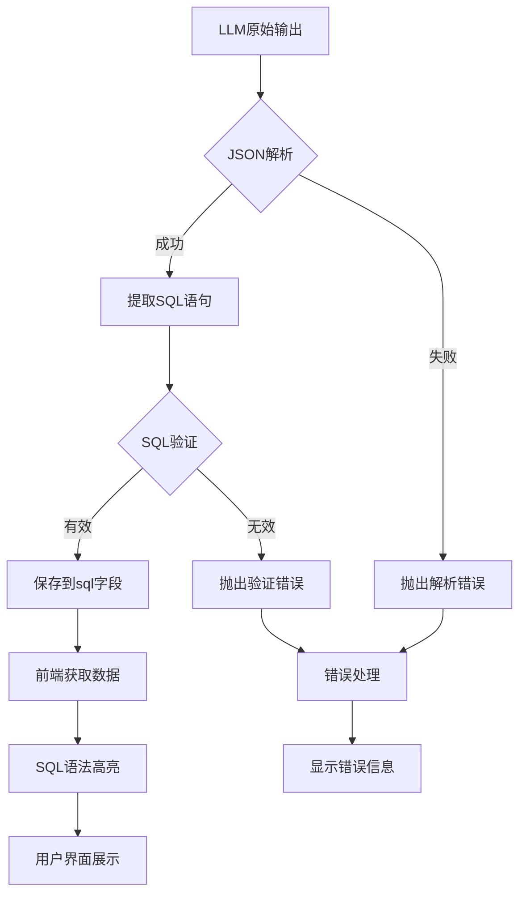

# 结果处理

<cite>
**本文档引用的文件**
- [llm.py](file://backend/apps/chat/task/llm.py)
- [SQLComponent.vue](file://frontend/src/views/chat/component/SQLComponent.vue)
- [chat_model.py](file://backend/apps/chat/models/chat_model.py)
- [chat.py](file://backend/apps/chat/curd/chat.py)
</cite>

## 目录
1. [引言](#引言)
2. [LLM响应解析与SQL验证](#llm响应解析与sql验证)
3. [数据存储模型](#数据存储模型)
4. [前端SQL高亮显示](#前端sql高亮显示)
5. [后端持久化处理](#后端持久化处理)
6. [数据流图](#数据流图)
7. [常见问题与优化策略](#常见问题与优化策略)
8. [结论](#结论)

## 引言
本技术文档详细说明了SQL生成结果的处理流程。系统通过解析LLM返回的JSON响应，提取SQL语句并进行语法验证，将结果存储到数据库，并在前端实现语法高亮显示。文档涵盖了从LLM原始输出到前端可视化展示的全过程，包括核心方法、数据模型、前后端交互和优化策略。

## LLM响应解析与SQL验证

系统通过`check_sql`和`check_save_sql`方法解析LLM返回的JSON响应并提取SQL语句。`check_sql`方法首先使用`extract_nested_json`函数从响应字符串中提取嵌套的JSON内容。如果无法解析JSON，会抛出包含详细错误信息的`SingleMessageError`异常。

解析成功后，方法检查JSON数据中的`success`字段。如果为真，则提取`sql`字段的值作为SQL语句；如果为假，则抛出包含错误消息的异常。最后，方法验证提取的SQL语句是否为空，确保生成的SQL有效。

`check_save_sql`方法调用`check_sql`进行解析和验证，然后将提取的SQL语句通过`save_sql`函数持久化到数据库中，同时更新当前会话的SQL查询。

**Section sources**
- [llm.py](file://backend/apps/chat/task/llm.py#L705-L736)

## 数据存储模型

`ChatRecord`模型定义了SQL生成结果的存储结构，包含多个关键字段：

- `sql`：存储经过验证的SQL语句
- `sql_answer`：存储LLM返回的原始响应，可能包含推理过程和SQL语句
- `error`：存储执行过程中产生的错误信息
- `data`：存储SQL执行结果的数据
- `chart`：存储图表配置信息
- `analysis`：存储数据分析结果

这些字段共同构成了完整的对话记录，支持SQL生成、执行、可视化和错误处理的全流程。`sql`字段专门用于存储最终验证通过的SQL语句，而`sql_answer`字段则保留了LLM的完整响应，便于调试和审计。

**Section sources**
- [chat_model.py](file://backend/apps/chat/models/chat_model.py#L76-L103)

## 前端SQL高亮显示

前端通过`SQLComponent.vue`组件实现SQL语法高亮显示。组件使用`highlight.js`库对SQL代码进行语法着色，提升可读性。核心实现包括：

1. 导入`highlight.js`的GitHub样式和SQL语言支持
2. 使用`v-dompurify-html`指令安全地渲染HTML内容，防止XSS攻击
3. 通过`hljs.highlight`方法对SQL字符串进行语法高亮处理

组件的CSS样式定义了代码块的外观，包括背景色、边框、圆角和内边距，确保良好的视觉体验。`v-dompurify-html`指令在渲染前对HTML内容进行净化处理，确保安全性。

**Section sources**
- [SQLComponent.vue](file://frontend/src/views/chat/component/SQLComponent.vue#L1-L30)

## 后端持久化处理

后端通过一系列CURD函数将SQL生成结果持久化到数据库。核心函数包括：

- `save_sql_answer`：将LLM的原始响应保存到`sql_answer`字段
- `save_sql`：将验证通过的SQL语句保存到`sql`字段
- `save_error_message`：将错误信息保存到`error`字段并标记记录为完成状态
- `save_sql_exec_data`：将SQL执行结果数据保存到`data`字段

`format_record`函数在返回数据前进行格式化处理，包括：
- 解析`sql_answer`中的JSON内容，提取推理过程
- 使用`sqlparse.format`对SQL语句进行重新格式化，实现自动缩进
- 解析`data`字段中的JSON数据，转换为对象格式

这些函数通过SQLAlchemy ORM操作数据库，确保数据的一致性和完整性。

**Section sources**
- [chat.py](file://backend/apps/chat/curd/chat.py#L437-L572)
- [chat.py](file://backend/apps/chat/curd/chat.py#L203-L250)

## 数据流图

**Diagram sources**
- [llm.py](file://backend/apps/chat/task/llm.py#L705-L736)
- [SQLComponent.vue](file://frontend/src/views/chat/component/SQLComponent.vue#L1-L30)
- [chat.py](file://backend/apps/chat/curd/chat.py#L437-L572)

## 常见问题与优化策略

### 常见问题诊断
1. **JSON解析失败**：检查LLM响应格式，确保包含有效的JSON结构
2. **SQL为空**：验证LLM提示词，确保明确要求生成SQL语句
3. **语法错误**：检查数据库方言设置，确保与目标数据库兼容

### 优化策略
1. **SQL格式化**：使用`sqlparse.format`实现自动缩进和美化
2. **执行预检**：在保存前进行语法验证，避免无效SQL
3. **错误处理**：提供详细的错误信息，便于调试和改进
4. **性能优化**：缓存常用查询，减少数据库访问次数

这些策略确保了系统的稳定性和用户体验，同时提供了良好的可维护性。

**Section sources**
- [llm.py](file://backend/apps/chat/task/llm.py#L705-L736)
- [chat.py](file://backend/apps/chat/curd/chat.py#L203-L250)

## 结论
本文档详细阐述了SQL生成结果的处理流程，从LLM响应解析、数据存储、前端显示到后端持久化。系统通过严谨的验证和格式化处理，确保了SQL语句的质量和安全性。前端的语法高亮功能提升了用户体验，而后端的CURD操作保证了数据的一致性。整体架构设计合理，具备良好的可扩展性和维护性。