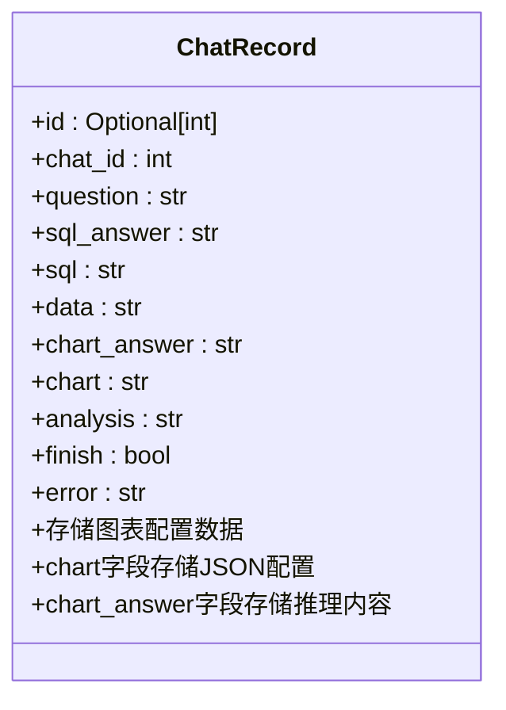
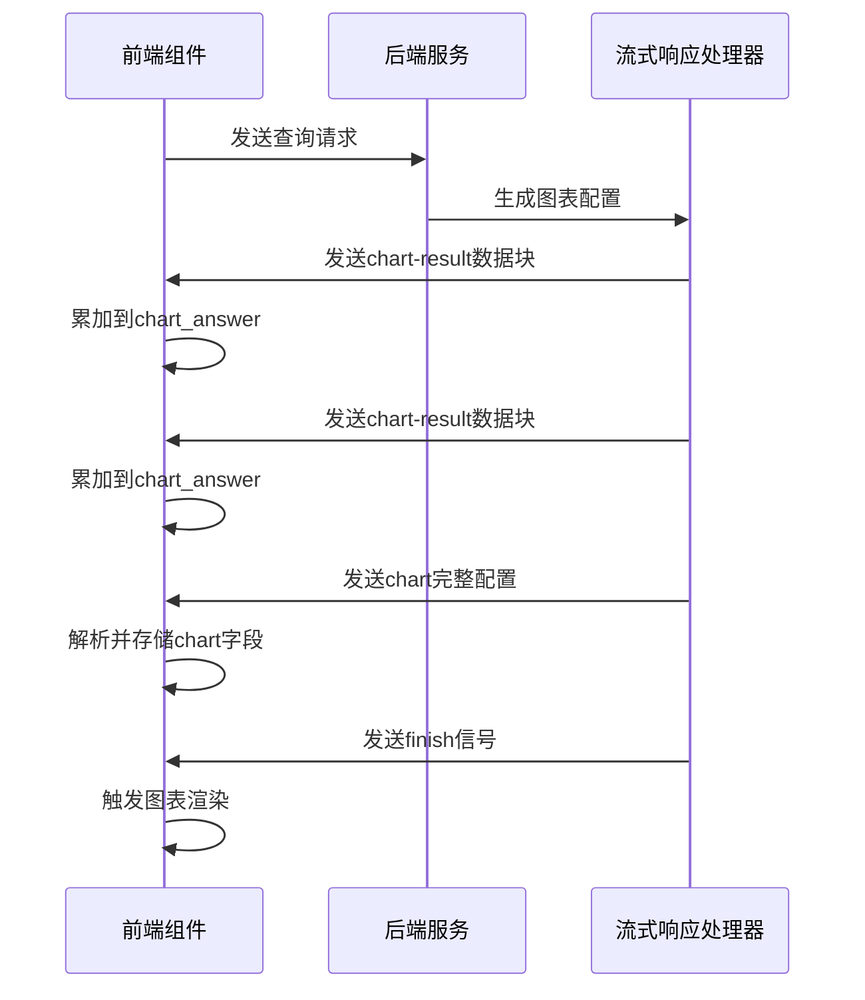
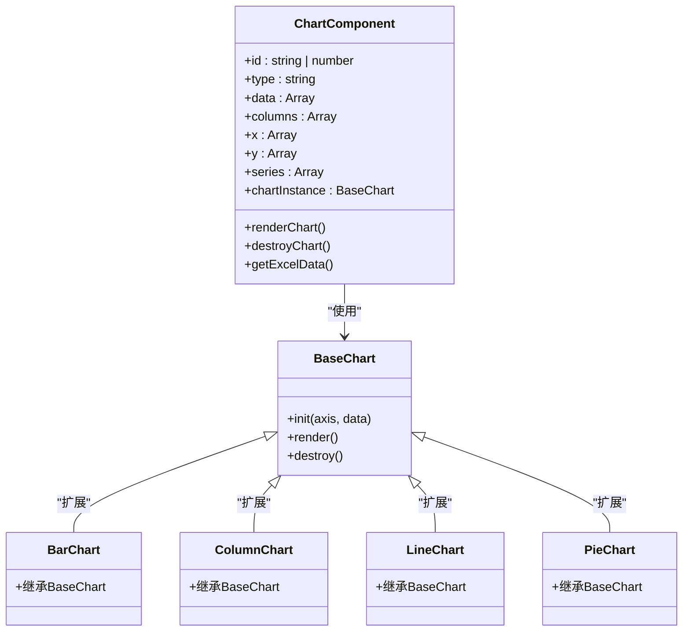
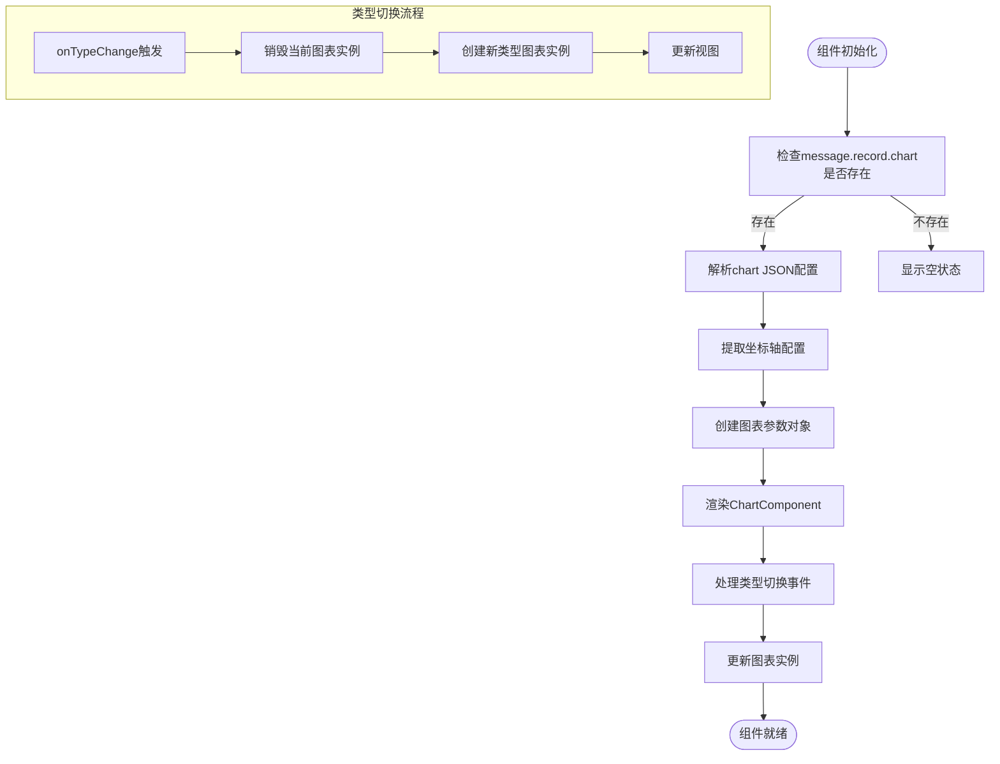
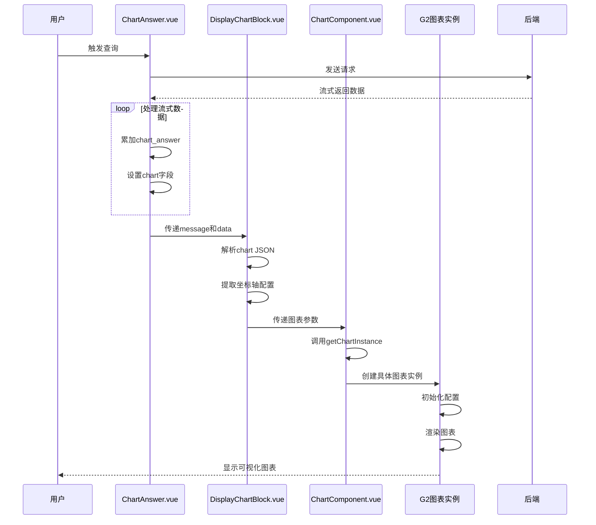
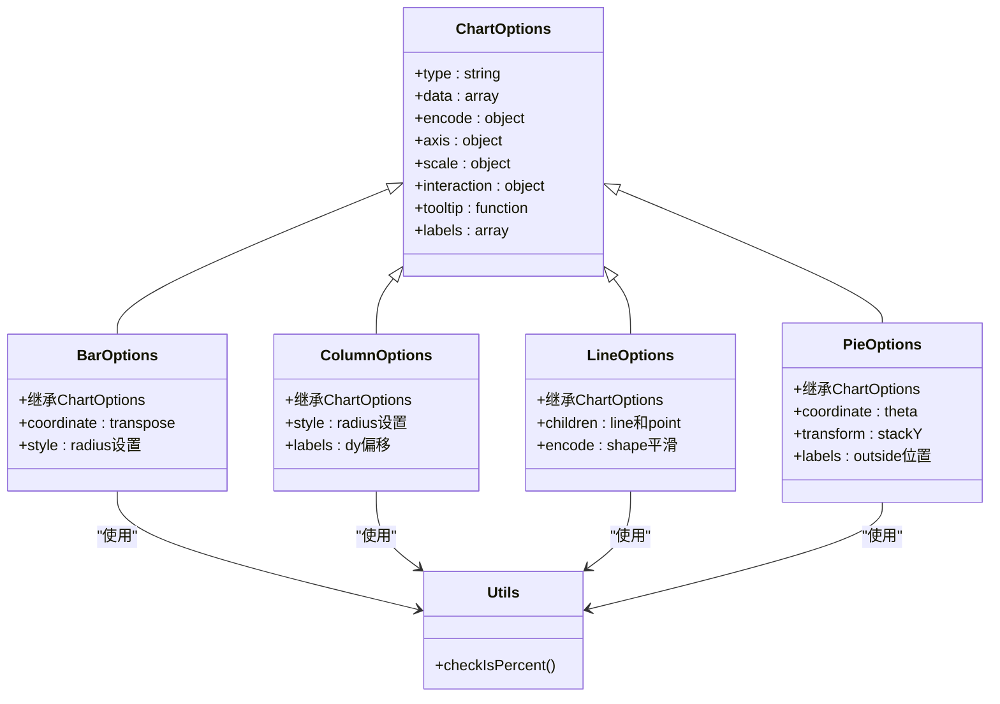
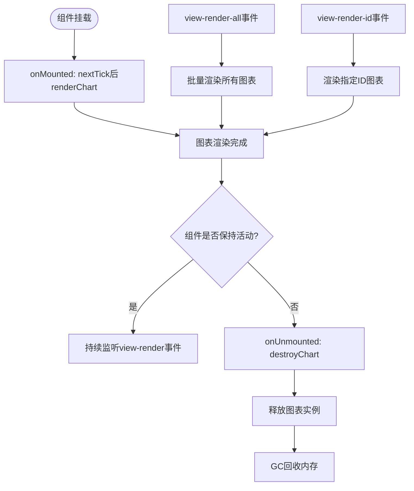

# 图表展示

<cite>
**本文档中引用的文件**  
- [chat_model.py](file://backend/apps/chat/models/chat_model.py)
- [ChartAnswer.vue](file://frontend/src/views/chat/answer/ChartAnswer.vue)
- [ChartComponent.vue](file://frontend/src/views/chat/component/ChartComponent.vue)
- [DisplayChartBlock.vue](file://frontend/src/views/chat/component/DisplayChartBlock.vue)
- [bar.js](file://g2-ssr/charts/bar.js)
- [column.js](file://g2-ssr/charts/column.js)
- [line.js](file://g2-ssr/charts/line.js)
- [pie.js](file://g2-ssr/charts/pie.js)
- [utils.js](file://g2-ssr/charts/utils.js)
</cite>

## 目录
1. [介绍](#介绍)
2. [后端图表配置生成机制](#后端图表配置生成机制)
3. [前端图表数据接收与解析](#前端图表数据接收与解析)
4. [图表实例化工厂模式](#图表实例化工厂模式)
5. [图表渲染协调组件](#图表渲染协调组件)
6. [完整图表渲染流程](#完整图表渲染流程)
7. [性能优化与错误处理](#性能优化与错误处理)

## 介绍
本系统实现了从自然语言查询到可视化图表的完整流程。系统通过后端模型分析SQL查询结果，生成图表配置数据，前端组件接收并解析这些数据，最终使用G2图表库进行渲染展示。整个流程涉及后端数据处理、前后端数据传输、前端组件化渲染等多个环节，形成了一个完整的数据可视化解决方案。

## 后端图表配置生成机制

后端通过`ChatRecord`模型中的`chart`和`chart_answer`字段来存储和传递图表配置数据。`chart_answer`字段存储图表生成过程中的推理内容，而`chart`字段则存储最终的图表配置JSON数据。

**图表来源**  
- [chat_model.py](file://backend/apps/chat/models/chat_model.py#L76-L103)

**节来源**  
- [chat_model.py](file://backend/apps/chat/models/chat_model.py#L76-L103)

## 前端图表数据接收与解析

前端通过`ChartAnswer.vue`组件接收并解析后端返回的图表数据。该组件继承自`BaseAnswer`，负责处理流式响应数据，并将图表配置信息提取到`ChatRecord`对象中。

当接收到`chart-result`类型的数据时，组件会将`reasoning_content`内容累加到`chart_answer`字段；当接收到`chart`类型的数据时，会直接将`content`内容赋值给`chart`字段。这种分步处理机制确保了图表配置数据的完整接收。

**图表来源**  
- [ChartAnswer.vue](file://frontend/src/views/chat/answer/ChartAnswer.vue#L100-L150)

**节来源**  
- [ChartAnswer.vue](file://frontend/src/views/chat/answer/ChartAnswer.vue#L100-L150)

## 图表实例化工厂模式

`ChartComponent.vue`组件实现了基于工厂模式的图表实例化机制。核心函数`getChartInstance`根据图表类型创建对应的G2图表实例，实现了图表类型的动态适配。

`getChartInstance`函数通过类型映射表`CHART_TYPE_MAP`查找对应的图表构造函数，并验证其是否继承自`BaseChart`基类，确保类型安全。这种工厂模式设计使得系统可以轻松扩展新的图表类型，只需在映射表中注册新的类型即可。

**图表来源**  
- [ChartComponent.vue](file://frontend/src/views/chat/component/ChartComponent.vue#L30-L40)
- [index.ts](file://frontend/src/views/chat/component/index.ts#L26-L31)

**节来源**  
- [ChartComponent.vue](file://frontend/src/views/chat/component/ChartComponent.vue#L30-L40)
- [index.ts](file://frontend/src/views/chat/component/index.ts#L26-L31)

## 图表渲染协调组件

`DisplayChartBlock.vue`组件负责协调图表的渲染、布局管理和交互功能。该组件作为图表展示的容器，处理了数据验证、图表类型切换和视图信息获取等核心功能。

组件通过计算属性`chartObject`解析`message.record.chart`中的JSON配置，提取图表类型、标题、坐标轴等信息。同时，通过`xAxis`、`yAxis`和`series`计算属性分别提取X轴、Y轴和系列配置，为`ChartComponent`提供标准化的输入参数。

当图表类型发生变化时，`onTypeChange`方法会触发图表实例的销毁和重新渲染，确保图表类型切换的平滑过渡。`getViewInfo`方法则提供了视图信息的标准化输出，便于与其他组件集成。

**图表来源**  
- [DisplayChartBlock.vue](file://frontend/src/views/chat/component/DisplayChartBlock.vue#L20-L60)

**节来源**  
- [DisplayChartBlock.vue](file://frontend/src/views/chat/component/DisplayChartBlock.vue#L20-L60)

## 完整图表渲染流程

从SQL查询结果到G2图表渲染的完整流程涉及多个组件的协同工作。首先，后端分析SQL执行结果，确定合适的图表类型，并生成相应的配置数据。然后，前端组件链式调用，逐步完成数据解析、实例化和渲染。

在G2图表实现层面，不同类型的图表（柱状图、条形图、折线图、饼图）都有对应的配置生成函数。这些函数基于基础配置，根据图表类型的特点进行定制化设置，如坐标轴样式、标签位置、交互行为等。

`utils.js`中的`checkIsPercent`工具函数负责检测数据是否为百分比格式，并进行相应的数据预处理，确保图表能够正确显示百分比数据。

**图表来源**  
- [bar.js](file://g2-ssr/charts/bar.js)
- [column.js](file://g2-ssr/charts/column.js)
- [line.js](file://g2-ssr/charts/line.js)
- [pie.js](file://g2-ssr/charts/pie.js)
- [utils.js](file://g2-ssr/charts/utils.js)

**节来源**  
- [bar.js](file://g2-ssr/charts/bar.js)
- [column.js](file://g2-ssr/charts/column.js)
- [line.js](file://g2-ssr/charts/line.js)
- [pie.js](file://g2-ssr/charts/pie.js)
- [utils.js](file://g2-ssr/charts/utils.js)

## 性能优化与错误处理

系统在图表性能优化和错误处理方面采用了多种策略。首先，通过懒加载机制，只有当图表容器可见时才触发渲染，减少了不必要的计算开销。其次，利用Vue的生命周期钩子，在组件卸载时自动调用`destroyChart`方法，及时释放图表实例占用的内存资源。

错误处理机制主要体现在以下几个方面：在`ChartAnswer.vue`中捕获流式响应的解析错误，并通过`ElMessage`组件向用户展示错误信息；在图表配置生成阶段，各图表类型的配置函数都会进行基本的参数验证，如检查必要的坐标轴是否存在；在实例化阶段，`getChartInstance`函数会验证类型映射的有效性，避免创建未知类型的图表实例。

对于兼容性问题，系统通过统一的`BaseChart`基类抽象了不同图表库的差异，使得未来可以方便地替换或扩展图表渲染引擎，而无需大规模修改现有代码。

**节来源**  
- [ChartComponent.vue](file://frontend/src/views/chat/component/ChartComponent.vue#L70-L90)
- [ChartAnswer.vue](file://frontend/src/views/chat/answer/ChartAnswer.vue#L150-L200)