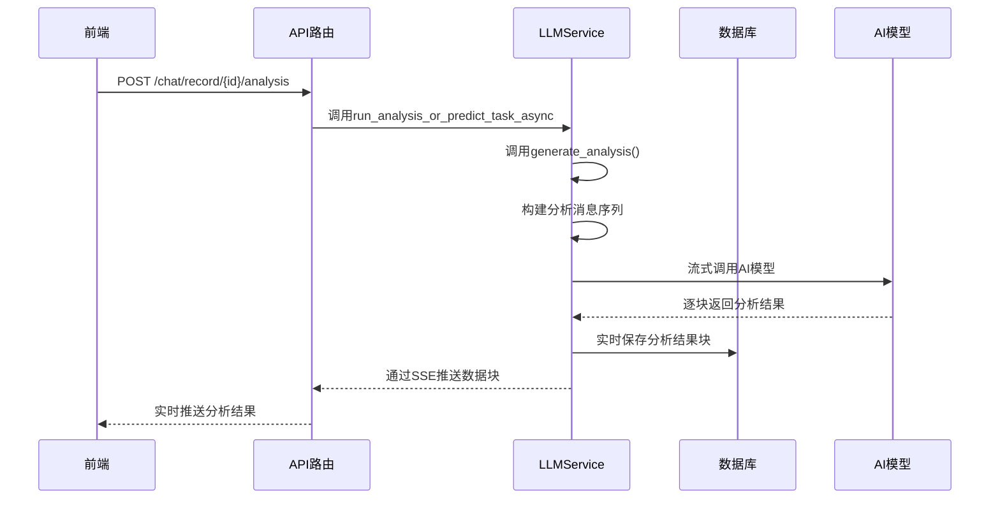
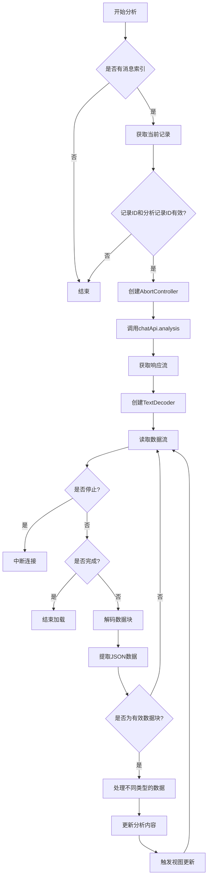

# 数据分析

<cite>
**本文档引用的文件**
- [generator.py](file://backend/apps/template/generate_analysis/generator.py)
- [AnalysisAnswer.vue](file://frontend/src/views/chat/answer/AnalysisAnswer.vue)
- [llm.py](file://backend/apps/chat/task/llm.py)
- [chat_model.py](file://backend/apps/chat/models/chat_model.py)
- [chat.ts](file://frontend/src/api/chat.ts)
- [template.py](file://backend/apps/template/template.py)
</cite>

## 目录
1. [简介](#简介)
2. [后端分析提示词生成机制](#后端分析提示词生成机制)
3. [AI模型分析结果生成与存储](#ai模型分析结果生成与存储)
4. [前端分析结果解析与渲染](#前端分析结果解析与渲染)
5. [完整分析流程示例](#完整分析流程示例)
6. [分析结果可读性优化策略](#分析结果可读性优化策略)
7. [异常情况处理](#异常情况处理)

## 简介
本文档详细阐述了数据分析功能的实现机制，涵盖从后端提示词生成、AI模型处理到前端渲染的完整流程。系统通过模板引擎生成结构化提示词，利用AI模型对数据进行深度分析，并将自然语言分析结果存储于数据库中。前端组件负责解析和渲染分析文本，提供富文本展示和响应式布局。文档还讨论了分析结果的可读性优化和异常处理策略。

## 后端分析提示词生成机制

后端通过`generate_analysis/generator.py`模块中的模板系统生成分析提示词。该模块依赖于`template.py`中定义的基础模板加载机制，从`template.yaml`配置文件中读取分析相关的系统提示和用户提示模板。

分析提示词的生成分为系统提示（system prompt）和用户提示（user prompt）两部分。系统提示定义了AI模型的分析角色、输出格式和语言要求，而用户提示则包含了具体的分析数据内容。`get_analysis_template()`函数负责获取完整的分析模板，该模板在`AiModelQuestion`类的`analysis_sys_question()`和`analysis_user_question()`方法中被具体化。

在生成提示词时，系统会从图表配置中提取字段信息（通过`get_fields_from_chart()`方法），并将图表数据序列化后注入用户提示中。这种模板化的方法确保了每次分析请求都具有统一的结构和上下文，提高了AI模型输出的一致性和准确性。

**Section sources**
- [generator.py](file://backend/apps/template/generate_analysis/generator.py#L3-L5)
- [template.py](file://backend/apps/template/template.py#L7-L15)
- [chat_model.py](file://backend/apps/chat/models/chat_model.py#L184-L213)

## AI模型分析结果生成与存储

AI模型分析流程由`LLMService`类的`generate_analysis()`方法驱动。该方法首先构建包含系统提示和用户提示的消息序列，然后通过流式（streaming）方式调用AI模型，实时处理模型的输出流。

分析过程的关键步骤包括：
1. 准备分析数据：从数据库获取图表配置和执行结果数据
2. 构建消息序列：将系统提示和用户提示组合成AI模型可理解的输入
3. 流式调用模型：使用`llm.stream()`方法逐块接收分析结果
4. 实时处理与存储：将接收到的每个数据块实时写入数据库，并通过SSE（Server-Sent Events）推送给前端

分析结果最终存储在`ChatRecord`模型的`analysis`字段中。该字段被定义为Text类型，能够存储大容量的自然语言分析文本。同时，系统还记录了分析过程中的思考内容（reasoning_content）和令牌使用情况（token_usage），为后续的性能优化和成本控制提供数据支持。

**Diagram sources**
- [llm.py](file://backend/apps/chat/task/llm.py#L215-L265)
- [chat_model.py](file://backend/apps/chat/models/chat_model.py#L94-L103)
- [chat.py](file://backend/apps/chat/api/chat.py#L154-L186)

**Section sources**
- [llm.py](file://backend/apps/chat/task/llm.py#L181-L265)
- [chat_model.py](file://backend/apps/chat/models/chat_model.py#L76-L103)

## 前端分析结果解析与渲染

前端通过`AnalysisAnswer.vue`组件负责解析和渲染AI模型生成的分析结果。该组件基于Vue 3的Composition API构建，采用响应式设计模式，能够实时更新分析内容。

组件的核心功能包括：
- **流式数据处理**：通过`fetchStream`方法接收SSE推送的分析结果，使用`TextDecoder`解码二进制流，并通过正则表达式`/data:.*}\n\n/g`提取JSON格式的数据块
- **实时渲染**：使用`nextTick()`确保DOM更新的及时性，将接收到的分析内容逐步拼接并更新到`ChatRecord`对象的`analysis`字段中
- **富文本处理**：通过`MdComponent`子组件渲染Markdown格式的分析文本，支持代码块高亮、表格、列表等富文本元素
- **响应式布局**：组件采用CSS变量和Flexbox布局，确保在不同屏幕尺寸下都能提供良好的用户体验

当用户停止分析请求时，组件会通过`AbortController`中断SSE连接，释放相关资源。组件的生命周期通过`onBeforeUnmount`钩子管理，确保在组件销毁时正确清理所有资源。

**Diagram sources**
- [AnalysisAnswer.vue](file://frontend/src/views/chat/answer/AnalysisAnswer.vue#L0-L222)

**Section sources**
- [AnalysisAnswer.vue](file://frontend/src/views/chat/answer/AnalysisAnswer.vue#L0-L222)
- [chat.ts](file://frontend/src/api/chat.ts#L30-L126)

## 完整分析流程示例

以下是从原始数据到洞察结论的完整分析流程示例：

1. **数据准备阶段**：用户提出问题"分析最近一个月的销售趋势"，系统生成相应的SQL查询并执行，获取原始数据集
2. **图表生成阶段**：系统根据数据特征自动生成折线图，展示销售额随时间的变化趋势
3. **分析提示生成阶段**：系统从图表配置中提取字段信息（如"日期"、"销售额"），并将执行结果数据序列化，注入分析模板
4. **AI模型分析阶段**：AI模型接收到结构化提示词，开始生成自然语言分析结果，内容包括：
   - 数据趋势描述："过去30天的销售额呈现稳步上升趋势，从月初的120万元增长到月末的180万元"
   - 异常点识别："在第15天出现销售额异常下降，从150万元骤降至90万元"
   - 业务建议："建议调查第15日的运营情况，检查是否存在系统故障或物流问题"
5. **结果存储与渲染阶段**：分析结果被实时存储到`ChatRecord.analysis`字段，并通过前端组件逐步渲染给用户

此流程展示了系统如何将结构化数据转化为有价值的业务洞察，帮助用户快速理解数据背后的含义。

**Section sources**
- [llm.py](file://backend/apps/chat/task/llm.py#L181-L265)
- [AnalysisAnswer.vue](file://frontend/src/views/chat/answer/AnalysisAnswer.vue#L0-L222)

## 分析结果可读性优化策略

为提高分析结果的可读性，系统采用了多种优化策略：

### 段落结构优化
分析结果采用清晰的段落结构，通常包括：
- **趋势概述**：对整体数据趋势的简要描述
- **细节分析**：对关键数据点和模式的深入分析
- **异常识别**：指出数据中的异常值或异常模式
- **业务建议**：基于分析结果提供的可操作建议

### 术语解释
系统会自动识别专业术语并在首次出现时提供简要解释。例如，在分析财务数据时，如果使用"同比增长率"这一术语，会在括号中注明"与去年同期相比的增长百分比"。

### 上下文关联
分析结果会与用户的原始问题保持紧密关联，确保分析内容直接回应用户的需求。同时，系统会引用具体的数值和时间范围，增强分析的可信度。

### 格式化处理
前端组件支持多种Markdown格式，包括：
- 代码块：用于展示关键数据或SQL查询
- 表格：用于对比不同时间段或类别的数据
- 列表：用于组织业务建议或行动项
- 强调：使用粗体和斜体突出重要信息

这些优化策略共同作用，确保分析结果既专业又易于理解。

**Section sources**
- [AnalysisAnswer.vue](file://frontend/src/views/chat/answer/AnalysisAnswer.vue#L0-L222)
- [llm.py](file://backend/apps/chat/task/llm.py#L215-L265)

## 异常情况处理

系统设计了完善的异常处理机制，以应对分析结果过长或格式错误的情况。

### 分析结果过长处理
当分析结果超过预期长度时，系统采用流式处理机制，将结果分块传输和存储。前端组件实时接收和显示每个数据块，避免了内存溢出和页面卡顿。同时，系统会监控令牌使用情况，当接近模型限制时，会自动截断输出并提示用户"分析结果因长度限制而截断"。

### 格式错误处理
对于AI模型可能产生的格式错误，系统实现了多层验证机制：
1. **JSON解析验证**：前端使用`try-catch`块捕获JSON解析错误，并在控制台输出错误信息
2. **数据类型验证**：后端在保存结果前验证数据结构的完整性
3. **错误恢复机制**：当检测到格式错误时，系统会尝试提取可用的文本内容，并标记"部分分析结果可能不完整"

### 用户交互处理
前端组件提供了明确的错误提示和恢复选项：
- **停止按钮**：允许用户随时中断分析过程
- **重试功能**：在分析失败后提供重试选项
- **错误信息展示**：将技术性错误信息转化为用户友好的提示

这些处理机制确保了系统在各种异常情况下的稳定性和可用性。

**Section sources**
- [AnalysisAnswer.vue](file://frontend/src/views/chat/answer/AnalysisAnswer.vue#L0-L222)
- [llm.py](file://backend/apps/chat/task/llm.py#L240-L265)