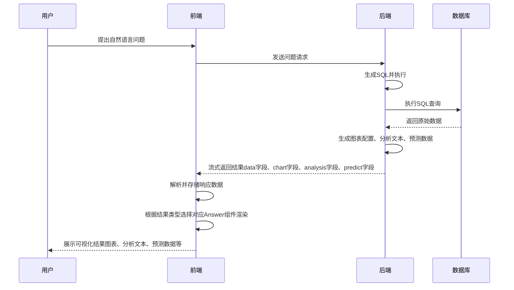
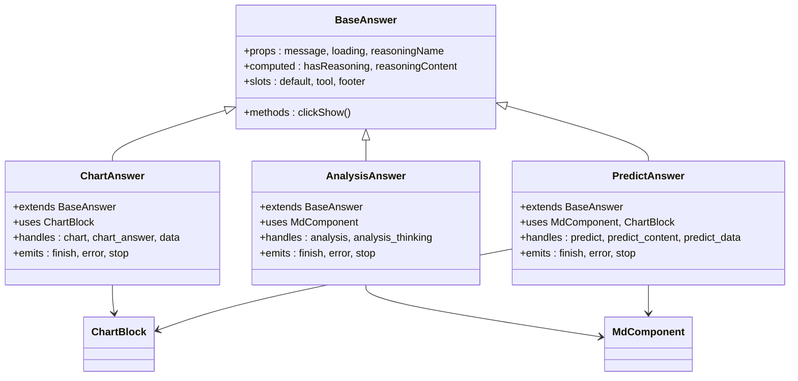
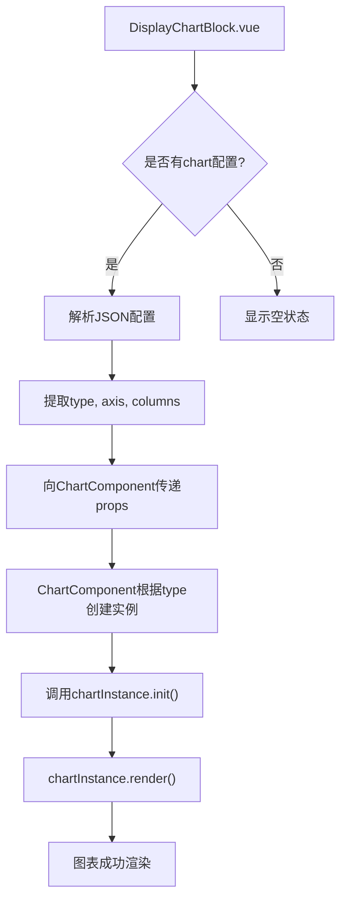

# 结果展示

<cite>
**本文档中引用的文件**  
- [chat_model.py](file://backend/apps/chat/models/chat_model.py)
- [ChartAnswer.vue](file://frontend/src/views/chat/answer/ChartAnswer.vue)
- [AnalysisAnswer.vue](file://frontend/src/views/chat/answer/AnalysisAnswer.vue)
- [PredictAnswer.vue](file://frontend/src/views/chat/answer/PredictAnswer.vue)
- [ChartComponent.vue](file://frontend/src/views/chat/component/ChartComponent.vue)
- [DisplayChartBlock.vue](file://frontend/src/views/chat/component/DisplayChartBlock.vue)
- [BaseAnswer.vue](file://frontend/src/views/chat/answer/BaseAnswer.vue)
</cite>

## 目录
1. [引言](#引言)  
2. [结果展示整体流程](#结果展示整体流程)  
3. [后端数据结构设计](#后端数据结构设计)  
4. [前端组件职责划分](#前端组件职责划分)  
5. [图表渲染机制详解](#图表渲染机制详解)  
6. [用户体验优化策略](#用户体验优化策略)  
7. [结论](#结论)

## 引言
本系统通过自然语言交互实现数据查询与分析，其核心功能之一是将后端生成的结构化结果以可视化形式呈现给用户。该过程涉及从后端模型输出到前端组件渲染的完整链路，涵盖数据格式转换、多类型结果处理（表格、图表、分析文本、预测数据）以及动态交互展示。本文档详细解析这一流程，重点说明 `chat_model.py` 中关键字段的设计逻辑，并深入分析前端 `answer` 目录下各类 Answer 组件的实现机制与协作方式。

## 结果展示整体流程

**图示来源**  
- [chat_model.py](file://backend/apps/chat/models/chat_model.py#L90-L96)
- [ChartAnswer.vue](file://frontend/src/views/chat/answer/ChartAnswer.vue#L60-L120)
- [AnalysisAnswer.vue](file://frontend/src/views/chat/answer/AnalysisAnswer.vue#L60-L100)

**本节来源**  
- [chat_model.py](file://backend/apps/chat/models/chat_model.py#L90-L96)
- [ChartAnswer.vue](file://frontend/src/views/chat/answer/ChartAnswer.vue#L60-L120)

## 后端数据结构设计

后端通过 `ChatRecord` 模型定义了多种结果类型的存储字段，这些字段以 JSON 字符串形式存储结构化配置，为前端解析提供数据基础。

### 核心字段设计与数据结构

| 字段名 | 设计目的 | 数据结构与说明 |
|-------|--------|--------------|
| `data` | 存储SQL查询返回的原始二维数据集 | JSON字符串，格式为 `{"axis": [{"name": "列名", "value": "字段名"}], "data": [{"字段名": 值}, ...]}`，由 `ExcelData` 模型定义 |
| `chart` | 存储图表的元数据配置 | JSON字符串，包含 `type`（图表类型）、`title`（标题）、`axis`（坐标轴映射）、`columns`（字段列表）等，指导前端渲染何种图表 |
| `analysis` | 存储AI生成的分析性文本内容 | 纯文本或Markdown格式字符串，包含对数据的解读、洞察和结论 |
| `predict` | 存储预测任务的中间思考过程 | 文本内容，描述模型进行预测时的推理逻辑 |
| `predict_data` | 存储预测任务生成的结构化数据 | JSON字符串，格式与 `data` 字段类似，用于展示预测结果的图表 |

**本节来源**  
- [chat_model.py](file://backend/apps/chat/models/chat_model.py#L90-L96)
- [chat_model.py](file://backend/apps/chat/models/chat_model.py#L140-L155)
- [chat_model.py](file://backend/apps/chat/models/chat_model.py#L250-L255)

## 前端组件职责划分

前端通过组件化设计实现不同类型结果的展示，`answer` 目录下的组件各司其职，共同完成结果渲染。

### Answer组件职责分析

**图示来源**  
- [BaseAnswer.vue](file://frontend/src/views/chat/answer/BaseAnswer.vue#L1-L175)
- [ChartAnswer.vue](file://frontend/src/views/chat/answer/ChartAnswer.vue#L1-L259)
- [AnalysisAnswer.vue](file://frontend/src/views/chat/answer/AnalysisAnswer.vue#L1-L223)
- [PredictAnswer.vue](file://frontend/src/views/chat/answer/PredictAnswer.vue#L1-L268)

#### BaseAnswer.vue
作为所有Answer组件的基类，提供通用UI结构和逻辑。它负责展示“思考中”按钮、可折叠的推理过程（reasoning content）以及主要内容区域。通过 `reasoningName` 属性接收需要展示的推理字段名，利用计算属性 `reasoningContent` 从 `message.record` 中提取对应内容。

**本节来源**  
- [BaseAnswer.vue](file://frontend/src/views/chat/answer/BaseAnswer.vue#L1-L175)

#### ChartAnswer.vue
负责处理与图表相关的所有逻辑。它继承 `BaseAnswer`，并嵌入 `ChartBlock` 组件。主要职责包括：通过SSE流式接收后端返回的 `chart` 和 `data` 字段，调用API获取图表数据，并将解析后的配置和数据传递给下层组件进行渲染。

**本节来源**  
- [ChartAnswer.vue](file://frontend/src/views/chat/answer/ChartAnswer.vue#L1-L259)

#### AnalysisAnswer.vue
专门用于展示AI生成的分析文本。它同样继承 `BaseAnswer`，并使用 `MdComponent` 来渲染 `analysis` 字段中的Markdown内容。当用户请求对已有数据进行深入分析时，该组件会被激活。

**本节来源**  
- [AnalysisAnswer.vue](file://frontend/src/views/chat/answer/AnalysisAnswer.vue#L1-L223)

#### PredictAnswer.vue
处理预测类任务的结果展示。它结合了 `MdComponent` 和 `ChartBlock`，既能展示预测的思考过程（`predict_content`），也能将预测生成的数据（`predict_data`）以图表形式呈现，实现分析与可视化的统一。

**本节来源**  
- [PredictAnswer.vue](file://frontend/src/views/chat/answer/PredictAnswer.vue#L1-L268)

## 图表渲染机制详解

图表的渲染是一个多层协作的过程，涉及 `DisplayChartBlock.vue` 和 `ChartComponent.vue` 等组件。

### 图表渲染流程

**图示来源**  
- [DisplayChartBlock.vue](file://frontend/src/views/chat/component/DisplayChartBlock.vue#L1-L109)
- [ChartComponent.vue](file://frontend/src/views/chat/component/ChartComponent.vue#L1-L109)

### 关键组件分析

#### ChartComponent.vue
该组件是G2图表的具体渲染器。它接收图表类型（`type`）、数据（`data`）和坐标轴配置（`x`, `y`, `series`）。在 `onMounted` 钩子中，通过 `getChartInstance` 工厂函数根据 `type` 创建对应的图表实例（如 `Bar`, `Line`），然后调用 `init` 和 `render` 方法完成渲染。它通过 `useEmitt` 监听全局渲染事件，确保在视图更新时能重新渲染。

**本节来源**  
- [ChartComponent.vue](file://frontend/src/views/chat/component/ChartComponent.vue#L1-L109)

#### DisplayChartBlock.vue
作为 `ChartComponent` 的容器，它负责解析后端返回的 `chart` 字段JSON。通过 `chartObject` 计算属性将字符串解析为对象，并从中提取 `xAxis`, `yAxis`, `series` 等配置，然后以 `props` 的形式传递给 `ChartComponent`。它还提供了 `onTypeChange` 方法，支持动态切换图表类型。

**本节来源**  
- [DisplayChartBlock.vue](file://frontend/src/views/chat/component/DisplayChartBlock.vue#L1-L109)

## 用户体验优化策略

系统在多个层面进行了用户体验优化，确保交互流畅、信息清晰。

### 加载状态与错误处理
- **加载状态**：所有Answer组件都接收 `loading` 属性。当 `sendMessage` 方法执行时，`_loading` 被设为 `true`，并在SSE流结束或出错时设为 `false`，前端据此显示加载动画。
- **错误信息展示**：在SSE流中，一旦接收到 `type: 'error'` 的消息，组件会将错误内容存入 `record.error`，并通过 `emits('error')` 通知父组件，通常会触发全局错误提示（如 `ElMessage`）。
- **流式响应**：采用SSE（Server-Sent Events）技术，后端分块返回结果，前端边接收边展示，显著提升响应感知速度。

### 响应式布局适配
- **容器设计**：`DisplayChartBlock.vue` 和 `ChartComponent.vue` 的根元素均设置了 `height: 100%; width: 100%`，使其能自适应父容器大小。
- **事件驱动渲染**：`ChartComponent.vue` 通过 `useEmitt` 监听 `view-render-all` 和 `view-render-{id}` 事件，确保在页面布局变化（如窗口缩放、标签页切换）后能主动触发图表重绘，保持图表显示正常。

**本节来源**  
- [ChartAnswer.vue](file://frontend/src/views/chat/answer/ChartAnswer.vue#L60-L120)
- [AnalysisAnswer.vue](file://frontend/src/views/chat/answer/AnalysisAnswer.vue#L60-L100)
- [DisplayChartBlock.vue](file://frontend/src/views/chat/component/DisplayChartBlock.vue#L100-L108)
- [ChartComponent.vue](file://frontend/src/views/chat/component/ChartComponent.vue#L80-L90)

## 结论
本系统的结果展示功能通过清晰的前后端分工和组件化设计，实现了从数据到洞察的高效转化。后端 `chat_model.py` 中的 `data`, `chart`, `analysis`, `predict` 等字段为结果的多样性提供了数据基础。前端通过 `BaseAnswer` 及其子类实现了职责分离，`ChartComponent` 和 `DisplayChartBlock` 则共同完成了图表的动态解析与渲染。结合SSE流式传输、错误处理和响应式布局等优化策略，为用户提供了流畅、直观的数据交互体验。