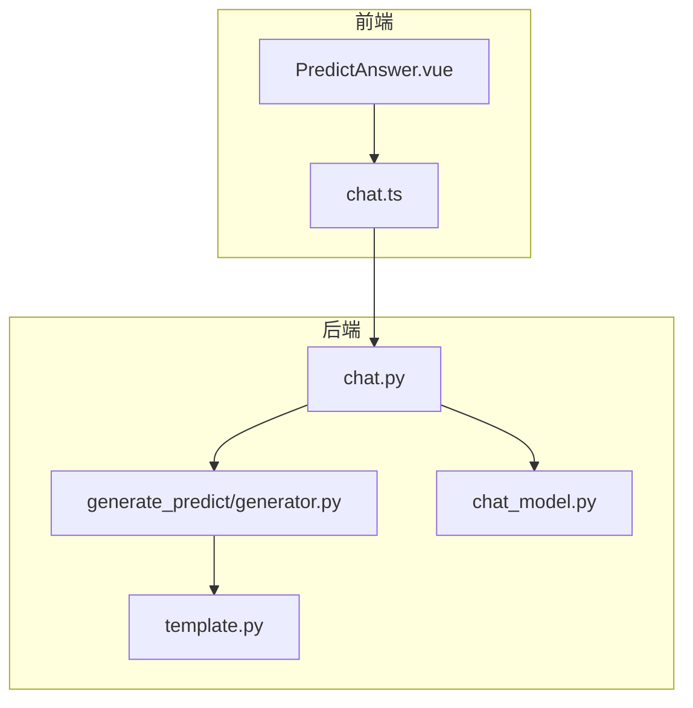
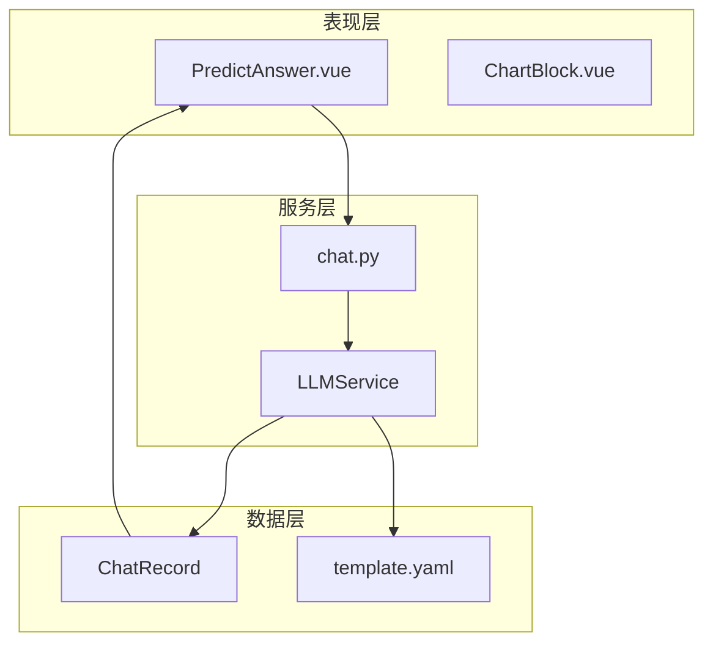
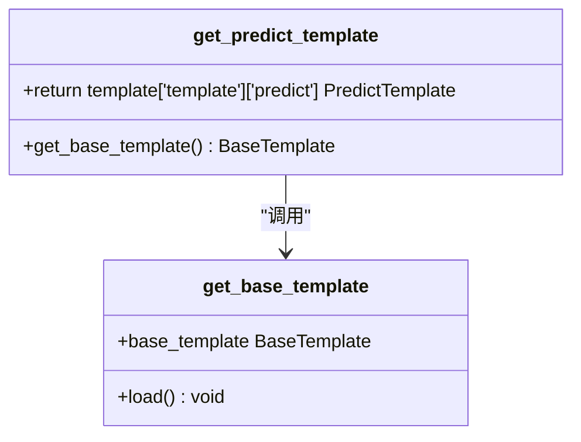
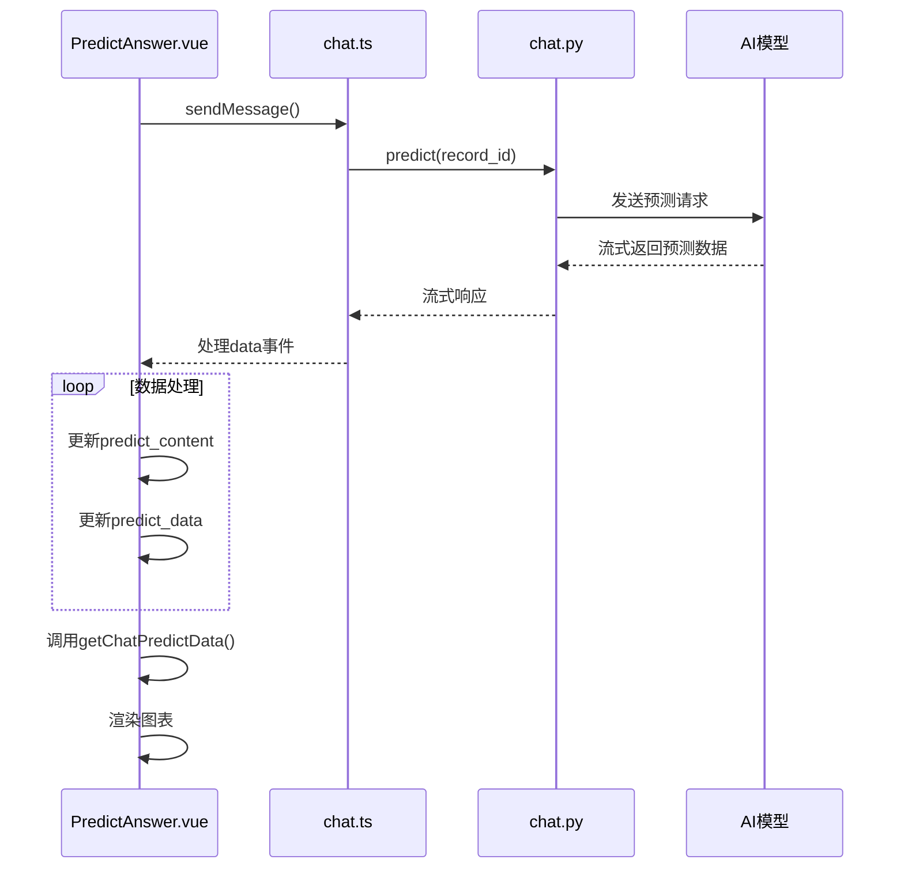
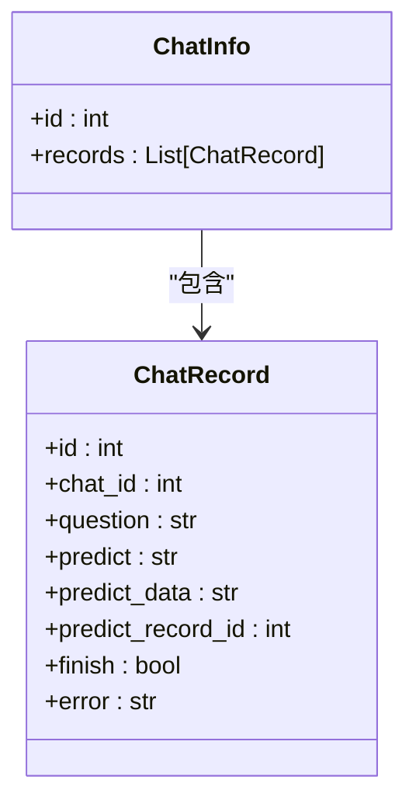
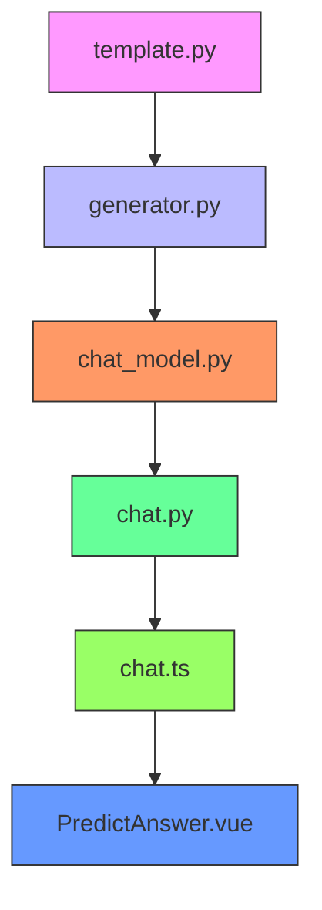

# 预测结果

<cite>
**本文档引用的文件**
- [generator.py](file://backend/apps/template/generate_predict/generator.py)
- [PredictAnswer.vue](file://frontend/src/views/chat/answer/PredictAnswer.vue)
- [chat_model.py](file://backend/apps/chat/models/chat_model.py)
- [template.py](file://backend/apps/template/template.py)
- [chat.ts](file://frontend/src/api/chat.ts)
- [chat.py](file://backend/apps/chat/api/chat.py)
</cite>

## 目录
1. [简介](#简介)
2. [项目结构](#项目结构)
3. [核心组件](#核心组件)
4. [架构概述](#架构概述)
5. [详细组件分析](#详细组件分析)
6. [依赖分析](#依赖分析)
7. [性能考虑](#性能考虑)
8. [故障排除指南](#故障排除指南)
9. [结论](#结论)

## 简介
本文档详细解析了SQLBot系统中预测功能的实现机制。重点阐述了后端如何通过预测模板生成AI提示词，将模型返回的预测数据存储在数据库中，以及前端如何解析和可视化这些预测结果。文档涵盖了从历史数据到未来趋势预测的完整流程，包括数据预处理、模型选择、结果可信度评估和异常处理策略。

## 项目结构
系统采用前后端分离架构，预测功能涉及多个核心模块。后端主要包含模板生成、API接口和数据模型，前端则负责结果的解析和可视化展示。

**图表来源**
- [PredictAnswer.vue](file://frontend/src/views/chat/answer/PredictAnswer.vue)
- [chat.ts](file://frontend/src/api/chat.ts)
- [generator.py](file://backend/apps/template/generate_predict/generator.py)
- [template.py](file://backend/apps/template/template.py)
- [chat_model.py](file://backend/apps/chat/models/chat_model.py)
- [chat.py](file://backend/apps/chat/api/chat.py)

**章节来源**
- [PredictAnswer.vue](file://frontend/src/views/chat/answer/PredictAnswer.vue)
- [generator.py](file://backend/apps/template/generate_predict/generator.py)
- [chat_model.py](file://backend/apps/chat/models/chat_model.py)

## 核心组件
预测功能的核心组件包括后端的预测模板生成器、数据存储模型和API接口，以及前端的预测结果解析和可视化组件。这些组件协同工作，实现了从用户请求到预测结果展示的完整流程。

**章节来源**
- [generator.py](file://backend/apps/template/generate_predict/generator.py#L3-L5)
- [chat_model.py](file://backend/apps/chat/models/chat_model.py#L76-L103)
- [PredictAnswer.vue](file://frontend/src/views/chat/answer/PredictAnswer.vue#L1-L267)

## 架构概述
预测功能的架构分为三个主要层次：数据层、服务层和表现层。数据层负责存储预测相关的原始数据和结果；服务层处理预测请求，与AI模型交互；表现层则负责将预测结果以用户友好的方式展示。

**图表来源**
- [PredictAnswer.vue](file://frontend/src/views/chat/answer/PredictAnswer.vue)
- [chat.py](file://backend/apps/chat/api/chat.py)
- [chat_model.py](file://backend/apps/chat/models/chat_model.py)
- [generator.py](file://backend/apps/template/generate_predict/generator.py)

## 详细组件分析

### 后端预测模板生成
后端通过`generate_predict/generator.py`文件中的`get_predict_template`函数生成预测任务的提示词模板。该函数从基础模板中提取预测相关的配置，为AI模型提供标准化的输入格式。

**图表来源**
- [generator.py](file://backend/apps/template/generate_predict/generator.py#L3-L5)
- [template.py](file://backend/apps/template/template.py#L7-L15)

**章节来源**
- [generator.py](file://backend/apps/template/generate_predict/generator.py#L3-L5)
- [template.py](file://backend/apps/template/template.py#L7-L15)

### 前端预测结果解析
前端的`PredictAnswer.vue`组件负责解析和展示预测结果。该组件通过WebSocket接收AI模型返回的流式数据，实时更新预测内容和数据，并将其以表格或图表形式展示给用户。

**图表来源**
- [PredictAnswer.vue](file://frontend/src/views/chat/answer/PredictAnswer.vue#L1-L267)
- [chat.ts](file://frontend/src/api/chat.ts#L30-L126)
- [chat.py](file://backend/apps/chat/api/chat.py#L1-L228)

**章节来源**
- [PredictAnswer.vue](file://frontend/src/views/chat/answer/PredictAnswer.vue#L1-L267)
- [chat.ts](file://frontend/src/api/chat.ts#L30-L126)

### 数据存储模型
`ChatRecord`模型定义了预测结果的存储结构，包含`predict`字段用于存储预测文本内容，`predict_data`字段用于存储结构化的预测数据。这些字段通过API接口与前端进行数据交换。

**图表来源**
- [chat_model.py](file://backend/apps/chat/models/chat_model.py#L76-L103)
- [chat.ts](file://frontend/src/api/chat.ts#L30-L126)

**章节来源**
- [chat_model.py](file://backend/apps/chat/models/chat_model.py#L76-L103)
- [chat.ts](file://frontend/src/api/chat.ts#L30-L126)

## 依赖分析
预测功能的实现依赖于多个模块的协同工作。后端模板系统为AI模型提供标准化的输入格式，数据模型定义了预测结果的存储结构，API接口实现了前后端的数据交换，前端组件则负责结果的解析和可视化。

**图表来源**
- [template.py](file://backend/apps/template/template.py)
- [generator.py](file://backend/apps/template/generate_predict/generator.py)
- [chat_model.py](file://backend/apps/chat/models/chat_model.py)
- [chat.py](file://backend/apps/chat/api/chat.py)
- [chat.ts](file://frontend/src/api/chat.ts)
- [PredictAnswer.vue](file://frontend/src/views/chat/answer/PredictAnswer.vue)

**章节来源**
- [template.py](file://backend/apps/template/template.py)
- [generator.py](file://backend/apps/template/generate_predict/generator.py)
- [chat_model.py](file://backend/apps/chat/models/chat_model.py)
- [chat.py](file://backend/apps/chat/api/chat.py)
- [chat.ts](file://frontend/src/api/chat.ts)
- [PredictAnswer.vue](file://frontend/src/views/chat/answer/PredictAnswer.vue)

## 性能考虑
预测功能的性能主要受AI模型响应速度和数据传输效率的影响。系统采用流式传输机制，可以在模型生成预测结果的同时逐步向用户展示，提高了用户体验。前端组件通过合理的状态管理和异步处理，确保了界面的流畅性。

## 故障排除指南
当预测功能出现问题时，可以从以下几个方面进行排查：检查AI模型服务是否正常运行，验证预测模板配置是否正确，确认数据库连接是否稳定，以及检查前端组件的状态管理逻辑。系统提供了详细的错误处理机制，可以在预测失败时向用户显示具体的错误信息。

**章节来源**
- [PredictAnswer.vue](file://frontend/src/views/chat/answer/PredictAnswer.vue#L1-L267)
- [chat.py](file://backend/apps/chat/api/chat.py#L1-L228)

## 结论
SQLBot的预测功能通过前后端的紧密协作，实现了从数据输入到结果展示的完整流程。后端通过标准化的模板生成机制与AI模型交互，将预测结果结构化存储；前端则通过高效的解析和可视化组件，为用户提供直观的预测结果展示。该功能的设计充分考虑了用户体验和系统性能，为数据分析提供了有力的支持。