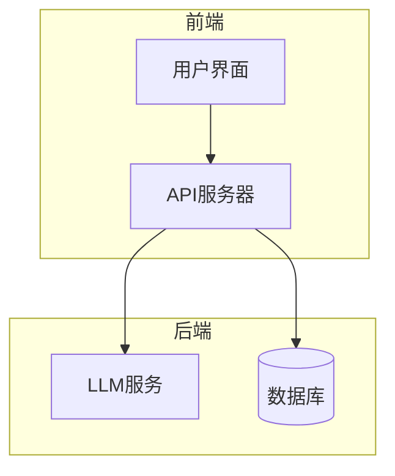
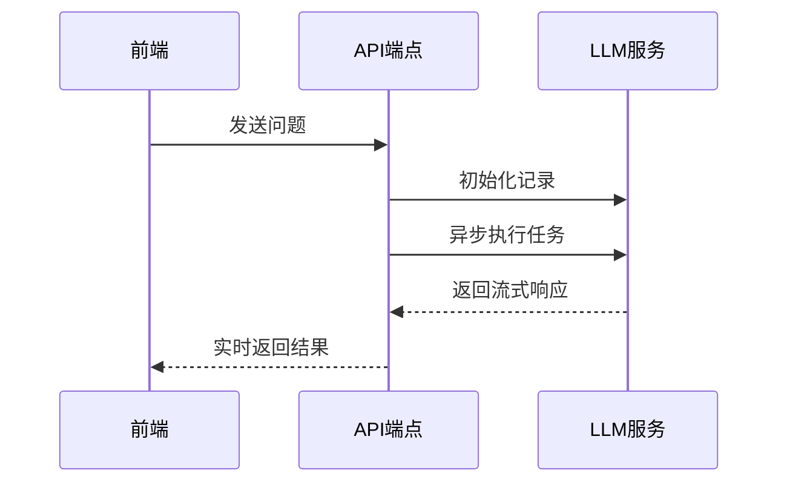
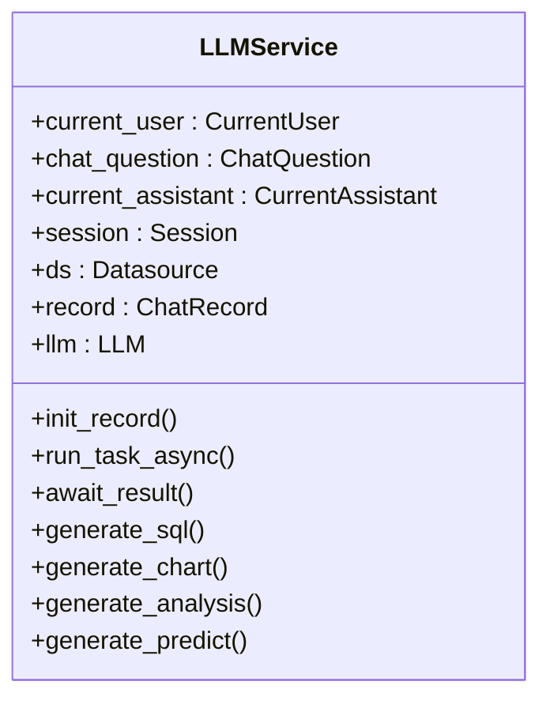
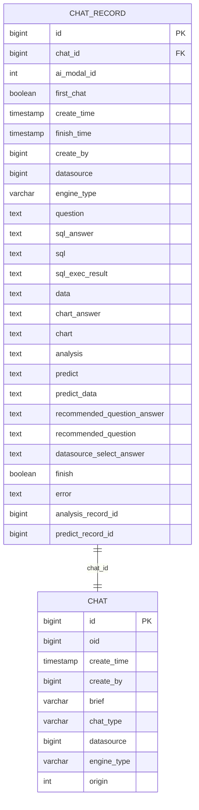
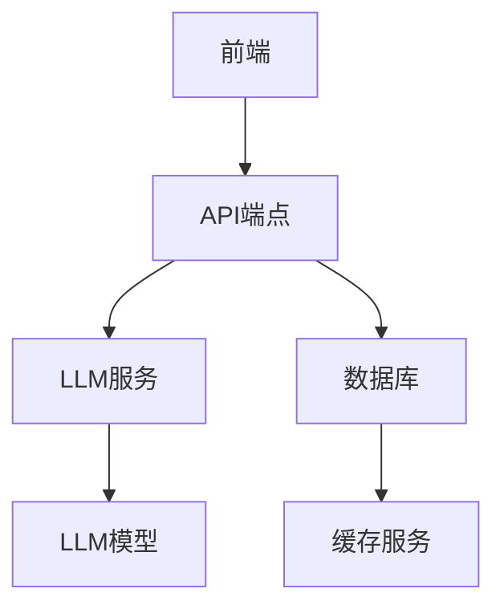

# 自然语言问答

<cite>
**本文档引用的文件**  
- [chat.py](file://backend/apps/chat/api/chat.py)
- [llm.py](file://backend/apps/ai_model/openai/llm.py)
- [chat_model.py](file://backend/apps/chat/models/chat_model.py)
- [index.vue](file://frontend/src/views/chat/index.vue)
- [sqlbot_cache.py](file://backend/common/core/sqlbot_cache.py)
</cite>

## 目录
1. [简介](#简介)
2. [项目结构](#项目结构)
3. [核心组件](#核心组件)
4. [架构概述](#架构概述)
5. [详细组件分析](#详细组件分析)
6. [依赖分析](#依赖分析)
7. [性能考虑](#性能考虑)
8. [故障排除指南](#故障排除指南)
9. [结论](#结论)

## 简介
本文档详细阐述了自然语言问答功能的实现机制，涵盖从用户输入到结果展示的完整处理流程。文档深入解析了问题解析、数据源选择、SQL生成、查询执行和结果可视化等关键环节。重点说明了后端API端点的实现机制、LLM调用的异步处理和流式响应技术，以及聊天记录的数据模型设计。同时，文档还解释了前端Chat组件与后端服务的交互模式，包括WebSocket连接管理和实时响应处理，并讨论了性能优化策略和常见问题的排查方法。

## 项目结构
项目采用分层架构设计，分为前端和后端两大模块。后端主要包含AI模型、聊天、数据源、数据库等核心组件，前端则包含API、组件、视图等模块。整体结构清晰，便于维护和扩展。

**Section sources**
- [chat.py](file://backend/apps/chat/api/chat.py#L1-L229)
- [llm.py](file://backend/apps/ai_model/openai/llm.py#L1-L168)
- [chat_model.py](file://backend/apps/chat/models/chat_model.py#L1-L256)
- [index.vue](file://frontend/src/views/chat/index.vue#L1-L1259)

## 核心组件
本节深入分析自然语言问答功能的核心组件，包括API端点、LLM服务和数据模型。

**Section sources**
- [chat.py](file://backend/apps/chat/api/chat.py#L1-L229)
- [llm.py](file://backend/apps/ai_model/openai/llm.py#L1-L168)
- [chat_model.py](file://backend/apps/chat/models/chat_model.py#L1-L256)

## 架构概述
系统采用前后端分离架构，前端通过API与后端进行交互。后端提供RESTful API接口，处理用户请求并返回结果。LLM服务负责自然语言处理和生成，数据模型定义了聊天记录的结构。

**Diagram sources**
- [chat.py](file://backend/apps/chat/api/chat.py#L1-L229)
- [index.vue](file://frontend/src/views/chat/index.vue#L1-L1259)

## 详细组件分析
本节对每个关键组件进行深入分析，包括其功能、实现细节和交互模式。

### API端点分析
后端API端点负责处理用户请求，包括聊天记录的创建、查询、重命名和删除等操作。`stream_sql`端点特别重要，它实现了流式响应，能够实时返回LLM生成的结果。

**Diagram sources**
- [chat.py](file://backend/apps/chat/api/chat.py#L130-L154)

**Section sources**
- [chat.py](file://backend/apps/chat/api/chat.py#L1-L229)

### LLM服务分析
LLM服务是自然语言问答功能的核心，负责处理用户问题并生成相应的SQL查询和图表。服务采用异步处理和流式响应技术，确保高效和实时的用户体验。

**Diagram sources**
- [llm.py](file://backend/apps/ai_model/openai/llm.py#L47-L1112)

**Section sources**
- [llm.py](file://backend/apps/ai_model/openai/llm.py#L1-L168)

### 数据模型分析
聊天记录的数据模型定义了用户会话的结构，包括问题、SQL查询、执行结果、图表和分析等内容。模型设计合理，能够支持复杂的问答场景。

**Diagram sources**
- [chat_model.py](file://backend/apps/chat/models/chat_model.py#L76-L103)

**Section sources**
- [chat_model.py](file://backend/apps/chat/models/chat_model.py#L1-L256)

## 依赖分析
系统依赖于多个外部组件，包括数据库、LLM模型和缓存服务。这些依赖通过工厂模式和依赖注入进行管理，确保系统的灵活性和可扩展性。

**Diagram sources**
- [chat.py](file://backend/apps/chat/api/chat.py#L1-L229)
- [llm.py](file://backend/apps/ai_model/openai/llm.py#L1-L168)
- [sqlbot_cache.py](file://backend/common/core/sqlbot_cache.py#L1-L141)

**Section sources**
- [sqlbot_cache.py](file://backend/common/core/sqlbot_cache.py#L1-L141)

## 性能考虑
系统采用多种性能优化策略，包括查询缓存、异步处理和流式响应。缓存服务能够显著减少重复查询的开销，异步处理确保高并发下的响应速度，流式响应提供实时的用户体验。

**Section sources**
- [sqlbot_cache.py](file://backend/common/core/sqlbot_cache.py#L1-L141)

## 故障排除指南
常见问题包括SQL生成错误、LLM调用失败和缓存失效。排查方法包括检查日志、验证数据源配置和清除缓存。对于SQL生成错误，可以检查用户问题的语法和数据源的元数据。

**Section sources**
- [chat.py](file://backend/apps/chat/api/chat.py#L1-L229)
- [llm.py](file://backend/apps/ai_model/openai/llm.py#L1-L168)
- [sqlbot_cache.py](file://backend/common/core/sqlbot_cache.py#L1-L141)

## 结论
本文档全面介绍了自然语言问答功能的实现细节，从架构设计到具体实现，从性能优化到故障排除，为开发者提供了完整的参考。通过深入理解这些内容，可以更好地维护和扩展系统功能。