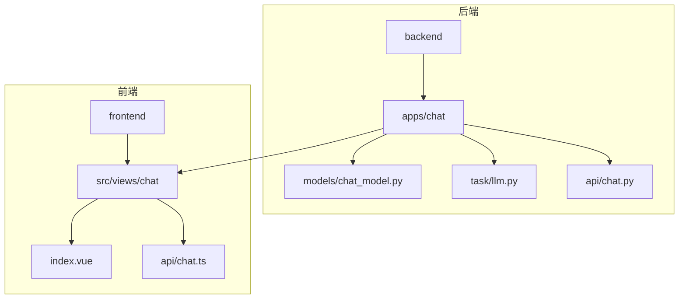
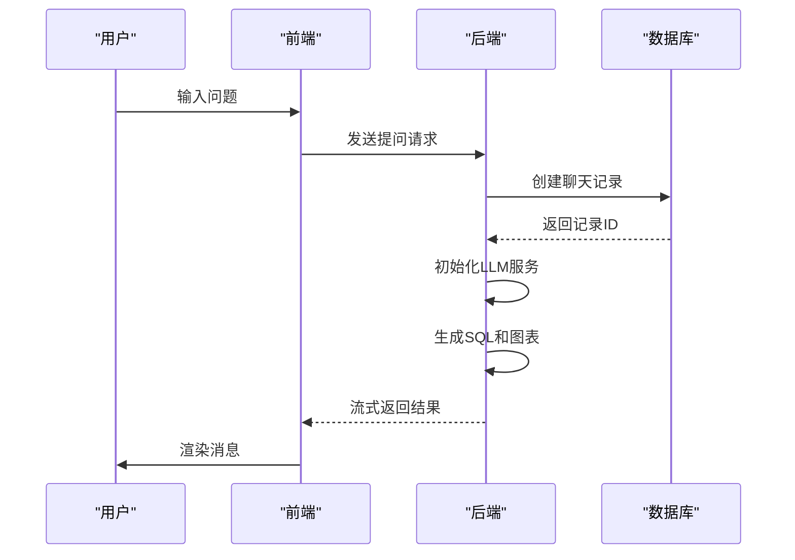
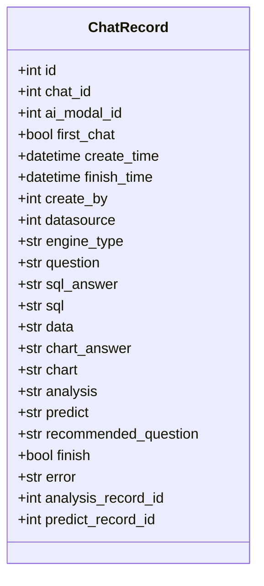
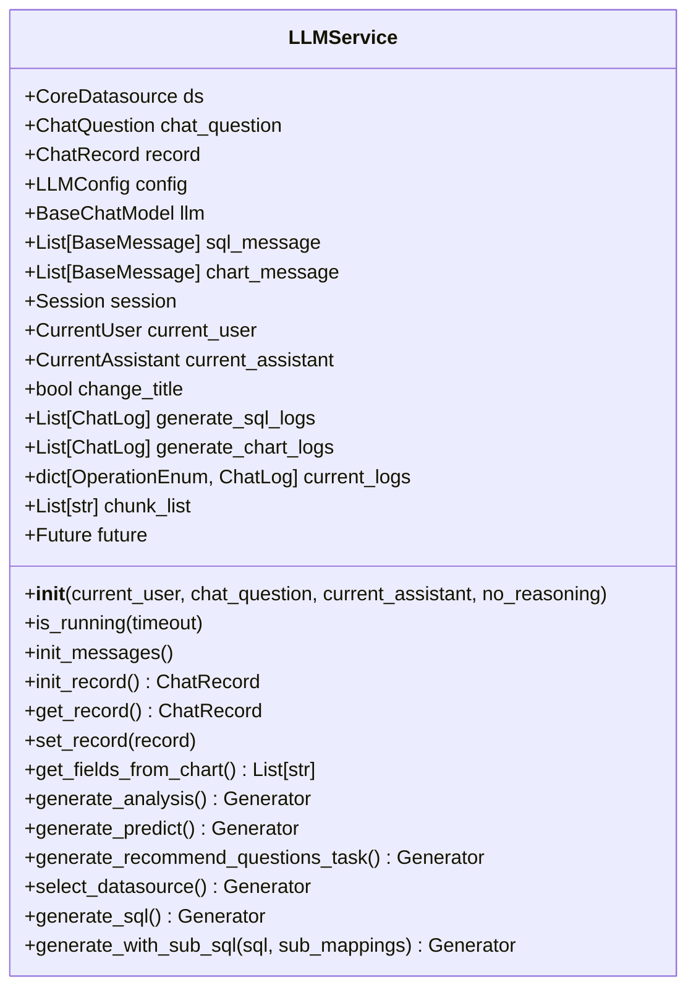
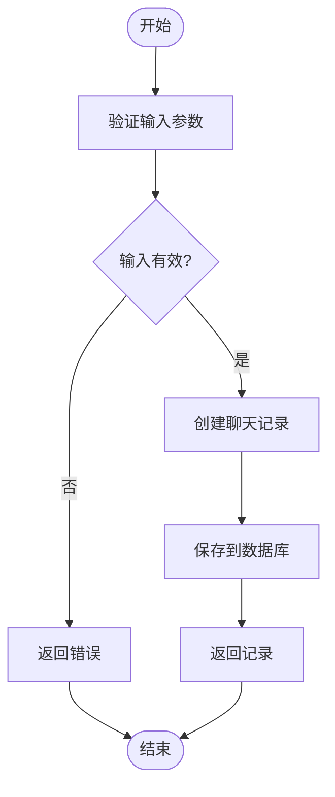
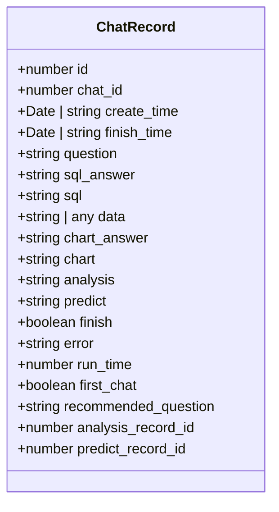
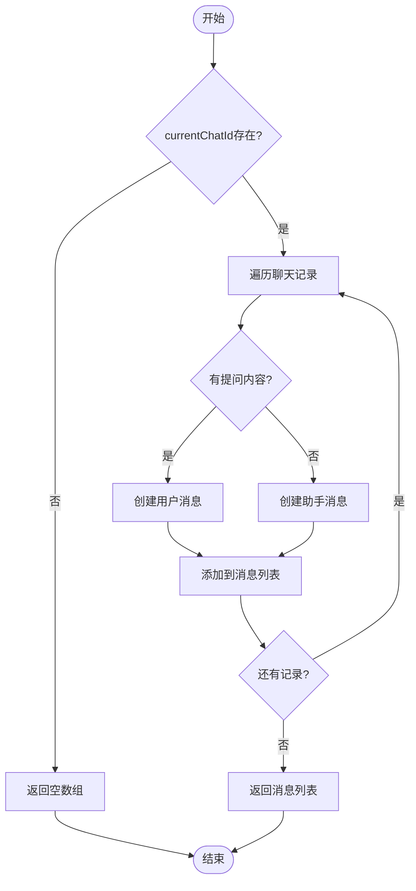
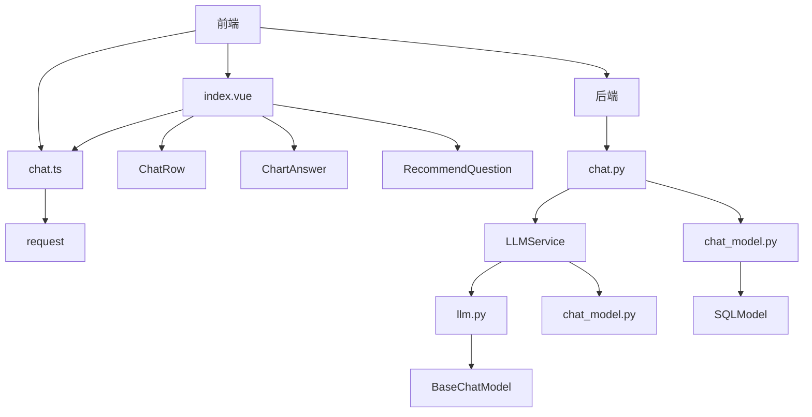

# 会话状态管理

<cite>
**本文档引用的文件**  
- [chat_model.py](file://backend/apps/chat/models/chat_model.py)
- [llm.py](file://backend/apps/chat/task/llm.py)
- [chat.py](file://backend/apps/chat/api/chat.py)
- [index.vue](file://frontend/src/views/chat/index.vue)
- [chat.ts](file://frontend/src/api/chat.ts)
</cite>

## 目录
1. [简介](#简介)
2. [项目结构](#项目结构)
3. [核心组件](#核心组件)
4. [架构概述](#架构概述)
5. [详细组件分析](#详细组件分析)
6. [依赖分析](#依赖分析)
7. [性能考虑](#性能考虑)
8. [故障排除指南](#故障排除指南)
9. [结论](#结论)

## 简介
本文档详细阐述了SQLBot系统中聊天会话状态管理的实现机制。重点分析了`ChatRecord`模型中`first_chat`字段的作用、`LLMService`类如何通过`init_record`方法创建新的聊天记录，以及前后端之间会话状态的同步方式。文档还描述了前端`computedMessages`计算属性如何将聊天记录转换为可渲染的消息列表，并提供了会话创建、更新和查询的完整流程示例。此外，还讨论了聊天记录的父子关系管理、状态变更传播以及性能优化策略。

## 项目结构
项目结构清晰地分为后端和前端两个主要部分。后端采用Python和FastAPI框架，包含聊天、数据源、仪表板等应用模块。前端使用Vue.js框架，实现了用户交互界面。会话状态管理的核心逻辑分布在后端的`backend/apps/chat`目录和前端的`frontend/src/views/chat`目录中。

**图表来源**
- [chat_model.py](file://backend/apps/chat/models/chat_model.py#L76-L103)
- [llm.py](file://backend/apps/chat/task/llm.py#L47-L1112)
- [index.vue](file://frontend/src/views/chat/index.vue#L0-L1259)

## 核心组件
核心组件包括`ChatRecord`模型、`LLMService`类和前端的`Chat`视图。`ChatRecord`模型定义了聊天记录的数据结构，`LLMService`类负责处理与大语言模型的交互，而前端`Chat`视图则负责用户界面的渲染和交互。

**章节来源**
- [chat_model.py](file://backend/apps/chat/models/chat_model.py#L76-L103)
- [llm.py](file://backend/apps/chat/task/llm.py#L47-L1112)
- [index.vue](file://frontend/src/views/chat/index.vue#L0-L1259)

## 架构概述
系统采用前后端分离的架构。前端通过API与后端通信，后端处理业务逻辑并与数据库交互。会话状态管理的核心流程包括：用户发起提问 -> 后端创建聊天记录 -> LLM服务处理请求 -> 前端接收并渲染结果。

**图表来源**
- [chat.py](file://backend/apps/chat/api/chat.py#L0-L228)
- [index.vue](file://frontend/src/views/chat/index.vue#L0-L1259)

## 详细组件分析

### ChatRecord模型分析
`ChatRecord`模型是会话状态管理的核心数据结构，其中`first_chat`字段具有特殊意义。

**图表来源**
- [chat_model.py](file://backend/apps/chat/models/chat_model.py#L76-L103)

`first_chat`字段用于标识该记录是否为会话中的第一条记录。当创建新的聊天会话时，系统会自动创建一条`first_chat`为`true`的空记录，作为会话的起点。这个字段在会话初始化和前端渲染中起着关键作用。

**章节来源**
- [chat_model.py](file://backend/apps/chat/models/chat_model.py#L76-L103)
- [chat.py](file://backend/apps/chat/curd/chat.py#L323)

### LLMService类分析
`LLMService`类是处理大语言模型交互的核心服务。

**图表来源**
- [llm.py](file://backend/apps/chat/task/llm.py#L47-L1112)

`init_record`方法是创建新聊天记录的关键。该方法调用`save_question`函数，在数据库中创建一条新的`ChatRecord`。这个过程包括验证聊天ID和问题内容，然后将记录保存到数据库并返回。

**图表来源**
- [llm.py](file://backend/apps/chat/task/llm.py#L177-L179)
- [chat.py](file://backend/apps/chat/curd/chat.py#L341-L369)

**章节来源**
- [llm.py](file://backend/apps/chat/task/llm.py#L177-L179)
- [chat.py](file://backend/apps/chat/curd/chat.py#L341-L369)

### 前端会话状态同步分析
前端通过`computedMessages`计算属性将聊天记录转换为可渲染的消息列表。

**图表来源**
- [chat.ts](file://frontend/src/api/chat.ts#L30-L126)

`computedMessages`计算属性遍历`currentChat.value.records`，为每条记录生成对应的消息对象。对于用户提问，生成角色为"user"的消息；对于系统响应，生成角色为"assistant"的消息。`first_chat`字段用于控制是否显示推荐问题。

**图表来源**
- [index.vue](file://frontend/src/views/chat/index.vue#L431-L498)

**章节来源**
- [index.vue](file://frontend/src/views/chat/index.vue#L431-L498)

## 依赖分析
系统各组件之间的依赖关系如下：

**图表来源**
- [chat.ts](file://frontend/src/api/chat.ts#L0-L336)
- [index.vue](file://frontend/src/views/chat/index.vue#L0-L1259)
- [chat.py](file://backend/apps/chat/api/chat.py#L0-L228)
- [llm.py](file://backend/apps/chat/task/llm.py#L47-L1112)

**章节来源**
- [chat.ts](file://frontend/src/api/chat.ts#L0-L336)
- [index.vue](file://frontend/src/views/chat/index.vue#L0-L1259)
- [chat.py](file://backend/apps/chat/api/chat.py#L0-L228)
- [llm.py](file://backend/apps/chat/task/llm.py#L47-L1112)

## 性能考虑
系统在会话状态管理方面采用了多种性能优化策略：

1. **批量加载**：通过`get_chat_with_records_with_data`方法一次性加载会话的所有记录和相关数据，减少数据库查询次数。
2. **缓存机制**：前端使用`wsCache`对用户信息进行缓存，减少重复请求。
3. **流式响应**：后端采用`StreamingResponse`返回结果，前端可以边接收边渲染，提高用户体验。
4. **数据分页**：聊天记录列表支持分页查询，避免一次性加载过多数据。

**章节来源**
- [chat.py](file://backend/apps/chat/curd/chat.py#L0-L709)
- [user.ts](file://frontend/src/stores/user.ts#L85-L96)

## 故障排除指南
常见问题及解决方案：

1. **会话创建失败**：检查`create_chat`方法中的数据源验证逻辑，确保数据源存在且有效。
2. **LLM服务无响应**：检查`LLMService`的初始化过程，确保模型配置正确。
3. **前端消息不更新**：检查`computedMessages`的依赖项，确保`currentChat`和`records`正确更新。
4. **推荐问题不显示**：检查`first_chat`字段的值，确保会话第一条记录的该字段为`true`。

**章节来源**
- [chat.py](file://backend/apps/chat/api/chat.py#L0-L228)
- [index.vue](file://frontend/src/views/chat/index.vue#L0-L1259)

## 结论
本文档详细分析了SQLBot系统中会话状态管理的实现机制。通过`ChatRecord`模型的`first_chat`字段、`LLMService`类的`init_record`方法以及前端的`computedMessages`计算属性，系统实现了完整的会话状态管理。前后端通过清晰的API接口进行通信，确保了会话状态的一致性和实时性。系统还采用了多种性能优化策略，提高了用户体验。