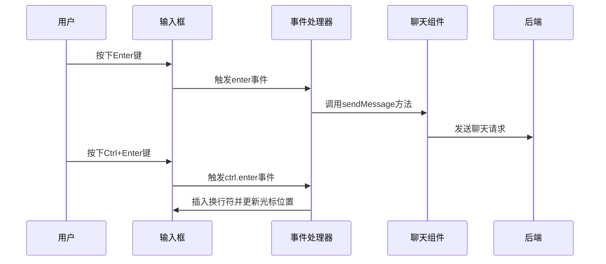
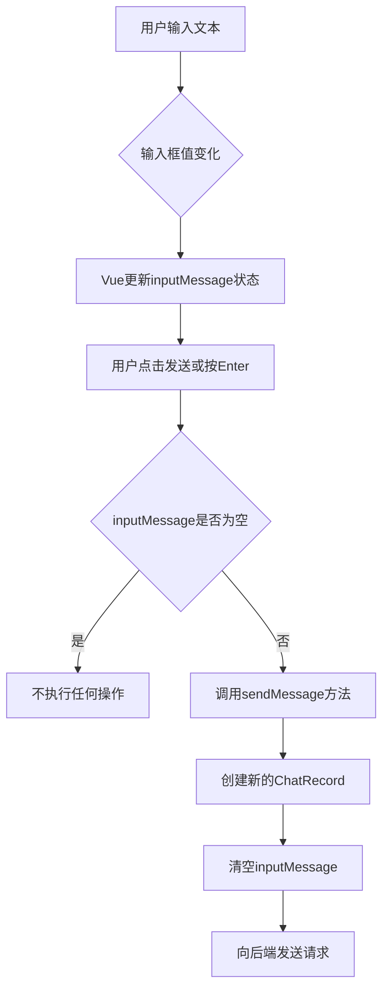
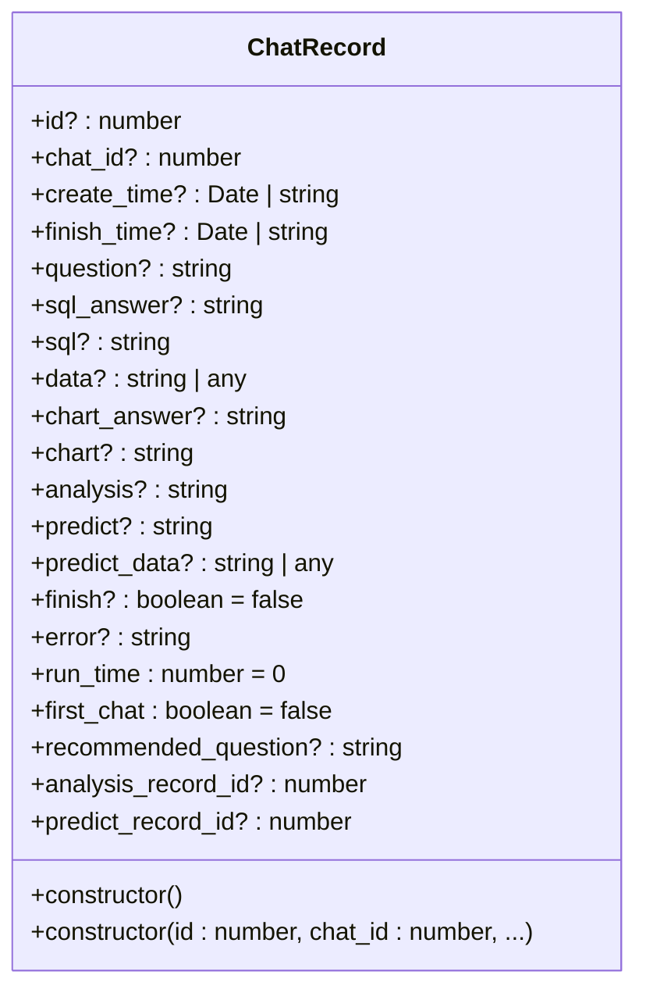
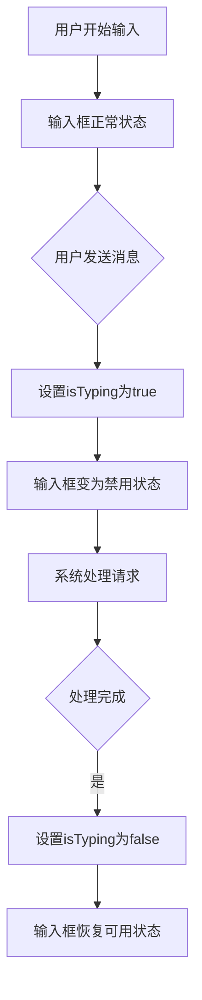
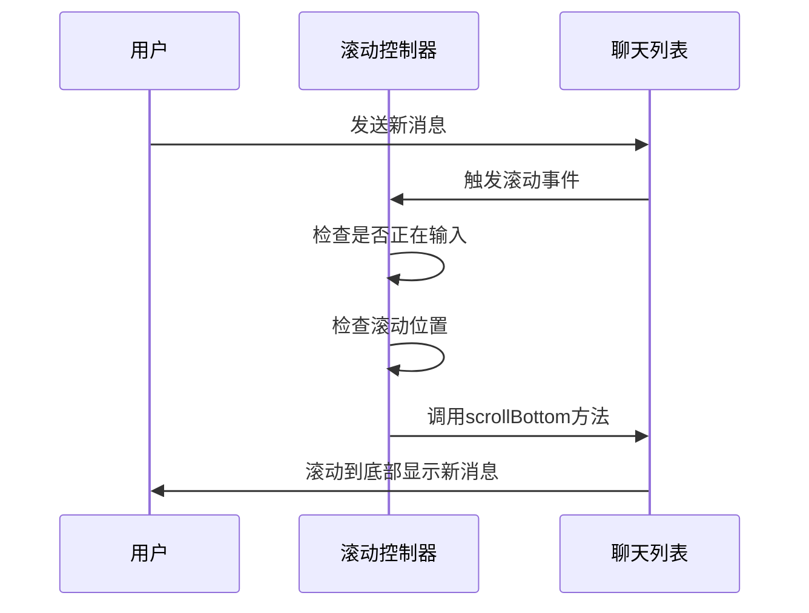

# 前端输入处理

<cite>
**本文档引用的文件**  
- [index.vue](file://frontend/src/views/chat/index.vue)
- [chat.ts](file://frontend/src/api/chat.ts)
- [ChartAnswer.vue](file://frontend/src/views/chat/answer/ChartAnswer.vue)
- [PredictAnswer.vue](file://frontend/src/views/chat/answer/PredictAnswer.vue)
- [AnalysisAnswer.vue](file://frontend/src/views/chat/answer/AnalysisAnswer.vue)
- [chat_model.py](file://backend/apps/chat/models/chat_model.py)
</cite>

## 目录
1. [简介](#简介)
2. [输入事件处理机制](#输入事件处理机制)
3. [输入状态管理](#输入状态管理)
4. [ChatRecord数据结构](#chatrecord数据结构)
5. [自动高度调整与禁用状态控制](#自动高度调整与禁用状态控制)
6. [用户体验细节](#用户体验细节)
7. [结论](#结论)

## 简介
本文档详细阐述了SQLBot项目中前端输入处理机制的实现细节。重点分析了Chat组件中用户输入的捕获与处理流程，包括输入框的事件监听、输入内容的验证与清理机制。文档详细说明了index.vue中如何通过sendMessage方法触发聊天请求，以及inputMessage状态的管理方式。同时描述了ChatRecord类在前端的数据结构定义及其与后端模型的映射关系。通过代码示例展示了输入事件的处理逻辑和表单状态的更新过程，并解释了输入框的自动高度调整功能和禁用状态的控制逻辑。最后讨论了用户体验相关的细节，如加载状态的视觉反馈和滚动到底部的自动行为。

## 输入事件处理机制

前端输入处理机制的核心在于对用户输入事件的精确捕获和差异化处理。系统通过在输入框上设置特定的键盘事件监听器来实现这一功能。

在`index.vue`文件中，输入框组件通过`@keydown.enter.exact.prevent`和`@keydown.ctrl.enter.exact.prevent`两个事件修饰符分别监听Enter键和Ctrl+Enter键的按下事件。这种设计允许用户通过不同的键盘组合实现不同的输入行为，提升了用户体验的灵活性。

当用户按下Enter键时，系统会触发`sendMessage`方法，将当前输入框中的内容作为问题发送给后端进行处理。而当用户按下Ctrl+Enter组合键时，系统会调用`handleCtrlEnter`方法，在当前光标位置插入一个换行符，允许用户在输入框中创建多行文本而不会立即发送消息。

**Diagram sources**
- [index.vue](file://frontend/src/views/chat/index.vue#L334)

**Section sources**
- [index.vue](file://frontend/src/views/chat/index.vue#L334)

## 输入状态管理

输入状态管理是前端聊天功能的核心部分，主要通过Vue的响应式系统来实现。系统使用`ref`函数创建响应式的`inputMessage`变量来跟踪用户输入的内容。

当用户在输入框中输入文本时，`v-model`指令会自动将输入框的值与`inputMessage`变量进行双向绑定。这种绑定机制确保了UI和数据状态始终保持同步。当用户点击发送按钮或按下Enter键时，`sendMessage`方法会被调用，该方法首先检查输入内容是否为空或仅包含空白字符，如果是，则直接返回不进行后续处理。

在`sendMessage`方法执行过程中，系统会创建一个新的`ChatRecord`实例，将`inputMessage`的值赋给该记录的`question`属性，然后将这个记录添加到当前聊天会话的记录列表中。最后，系统会清空`inputMessage`变量，为下一次输入做好准备。

**Diagram sources**
- [index.vue](file://frontend/src/views/chat/index.vue#L795)
- [chat.ts](file://frontend/src/api/chat.ts#L30)

**Section sources**
- [index.vue](file://frontend/src/views/chat/index.vue#L795)
- [chat.ts](file://frontend/src/api/chat.ts#L30)

## ChatRecord数据结构

ChatRecord类是前端与后端通信的核心数据结构，定义了聊天记录的完整信息模型。该类在前端和后端都有相应的定义，确保了数据的一致性和完整性。

在前端`chat.ts`文件中，`ChatRecord`类定义了多个属性，包括`id`、`chat_id`、`create_time`、`question`、`sql_answer`、`sql`、`data`、`chart_answer`、`chart`等。这些属性涵盖了从用户提问到系统响应的完整信息链。类还提供了多个构造函数重载，支持不同的初始化方式，增强了使用的灵活性。

后端`chat_model.py`文件中的`ChatRecord`模型与前端定义保持高度一致，但使用了SQLModel作为基类，并添加了数据库相关的字段配置。两个定义之间的映射关系通过属性名称直接对应，确保了数据在前后端传输时的正确解析。

**Diagram sources**
- [chat.ts](file://frontend/src/api/chat.ts#L30)
- [chat_model.py](file://backend/apps/chat/models/chat_model.py#L76)

**Section sources**
- [chat.ts](file://frontend/src/api/chat.ts#L30)
- [chat_model.py](file://backend/apps/chat/models/chat_model.py#L76)

## 自动高度调整与禁用状态控制

输入框的自动高度调整功能通过Element Plus组件库的`autosize`属性实现。在`index.vue`文件中，`el-input`组件的`autosize`属性被设置为`{ minRows: 1, maxRows: 8.583 }`，这表示输入框的最小行数为1，最大行数约为8.583行。当用户输入的内容超过一行时，输入框会自动扩展高度以适应内容，最多扩展到约8.583行的高度。

禁用状态的控制主要通过`isTyping`响应式变量实现。当系统正在处理用户请求或等待后端响应时，`isTyping`变量会被设置为`true`，此时输入框的`disabled`属性会绑定到`isTyping`值，使输入框变为禁用状态，防止用户在系统处理过程中发送新的请求。

这种状态控制机制有效地防止了用户在系统繁忙时发送重复请求，提高了系统的稳定性和用户体验。

**Diagram sources**
- [index.vue](file://frontend/src/views/chat/index.vue#L334)

**Section sources**
- [index.vue](file://frontend/src/views/chat/index.vue#L334)

## 用户体验细节

用户体验细节的设计体现了系统对用户交互流畅性的重视。加载状态的视觉反馈通过`loading`和`isTyping`两个布尔变量实现。当系统正在处理请求时，相关组件会显示加载动画或禁用交互元素，让用户明确知道系统正在工作。

滚动到底部的自动行为通过`scrollBottom`和`handleScroll`方法实现。`scrollBottom`方法使用`setScrollTop`将滚动条位置设置为容器的最大高度，实现滚动到底部的效果。`handleScroll`方法监听滚动事件，当检测到用户没有手动滚动且系统正在输入时，会启动一个定时器定期调用`scrollBottom`方法，确保新消息始终可见。

此外，系统还实现了Ctrl+Enter插入换行符的精细控制。`handleCtrlEnter`方法不仅在文本中插入换行符，还会使用`nextTick`确保DOM更新后调整光标位置到新插入的换行符之后，提供流畅的多行输入体验。

**Diagram sources**
- [index.vue](file://frontend/src/views/chat/index.vue#L458)

**Section sources**
- [index.vue](file://frontend/src/views/chat/index.vue#L458)

## 结论
本文档全面分析了SQLBot项目中前端输入处理机制的实现细节。通过深入研究代码结构，我们了解了从用户输入捕获到消息发送的完整流程。系统通过精心设计的事件处理机制、响应式状态管理、一致的数据结构定义以及细致的用户体验优化，构建了一个高效、稳定且用户友好的聊天界面。这些设计模式和实现方法为类似应用的开发提供了有价值的参考。