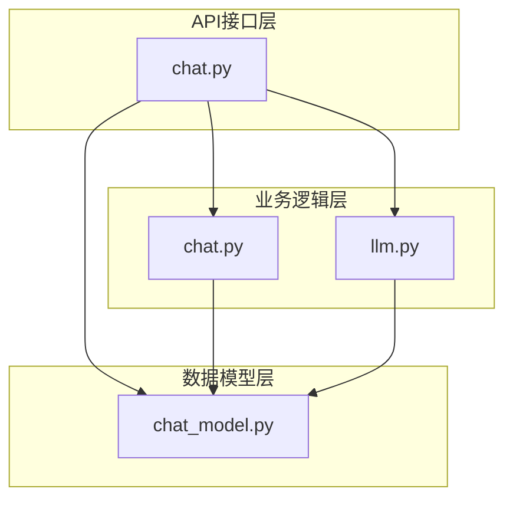
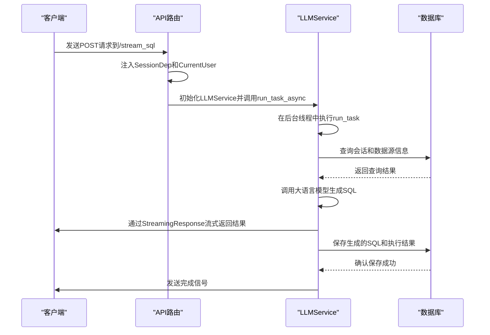
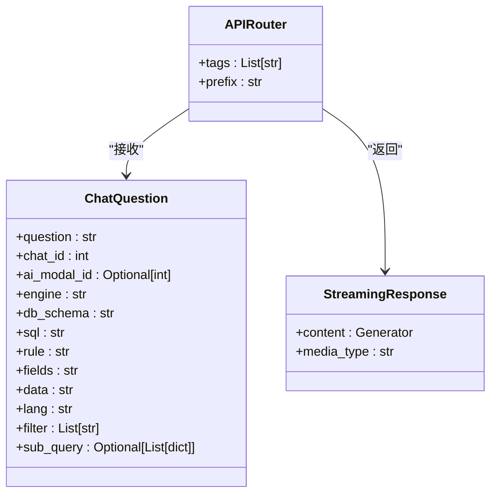
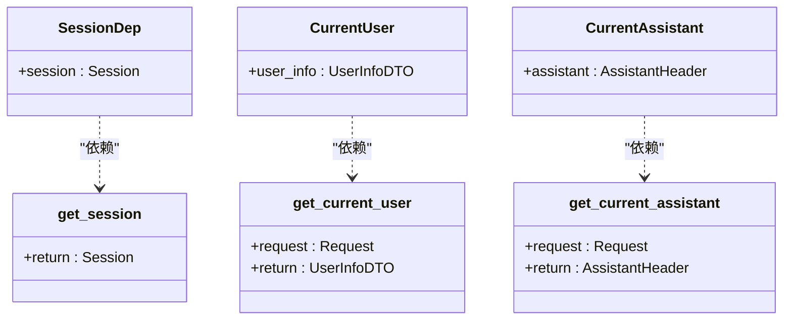
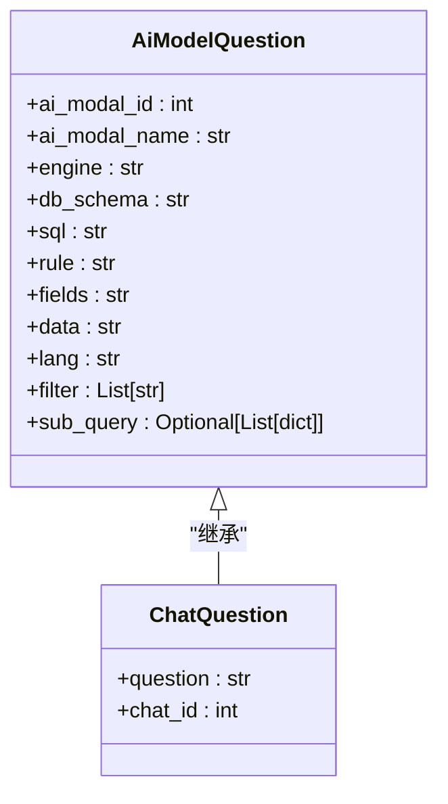
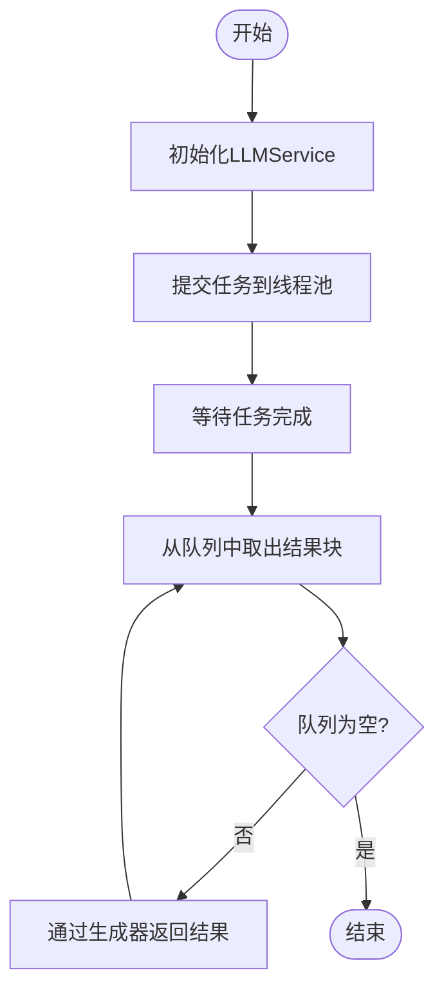
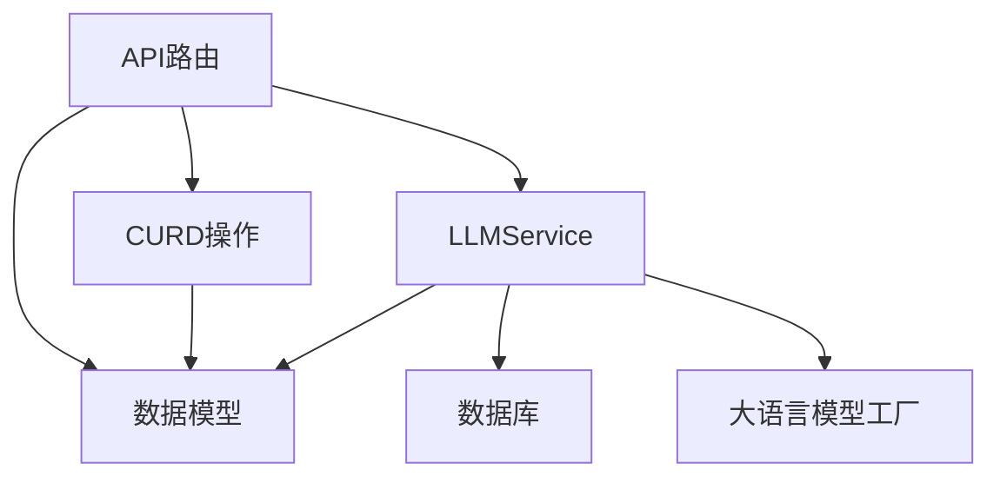

# 后端API处理

<cite>
**本文档引用的文件**
- [chat.py](file://backend/apps/chat/api/chat.py)
- [chat_model.py](file://backend/apps/chat/models/chat_model.py)
- [llm.py](file://backend/apps/chat/task/llm.py)
- [deps.py](file://backend/common/core/deps.py)
- [chat.py](file://backend/apps/chat/curd/chat.py)
</cite>

## 目录
1. [简介](#简介)
2. [项目结构](#项目结构)
3. [核心组件](#核心组件)
4. [架构概述](#架构概述)
5. [详细组件分析](#详细组件分析)
6. [依赖分析](#依赖分析)
7. [性能考虑](#性能考虑)
8. [故障排除指南](#故障排除指南)
9. [结论](#结论)

## 简介
本文档详细阐述了SQLBot项目中后端API请求处理流程的实现机制。重点分析了`chat.py`文件中各个API端点的实现，特别是`/stream_sql`端点如何处理流式响应。文档详细说明了FastAPI路由的定义方式、依赖注入的使用（如SessionDep、CurrentUser等）以及异常处理策略。同时，文档描述了ChatQuestion模型的字段定义和验证规则，以及其在请求处理中的作用。通过代码示例展示了API请求的完整处理流程，从接收请求到返回流式响应。此外，还解释了异步处理的实现方式，包括asyncio.to_thread的使用场景和优势，并讨论了API安全性考虑，如输入验证和错误信息的处理方式。

## 项目结构
SQLBot项目的后端API处理主要集中在`backend/apps/chat/`目录下，该目录包含了API接口、数据模型和业务逻辑处理的三个主要子模块。API接口定义在`api/`目录中，数据模型定义在`models/`目录中，而业务逻辑处理则在`curd/`和`task/`目录中实现。这种分层结构使得代码职责清晰，便于维护和扩展。

**Diagram sources**
- [chat.py](file://backend/apps/chat/api/chat.py)
- [chat_model.py](file://backend/apps/chat/models/chat_model.py)
- [chat.py](file://backend/apps/chat/curd/chat.py)
- [llm.py](file://backend/apps/chat/task/llm.py)

**Section sources**
- [chat.py](file://backend/apps/chat/api/chat.py)
- [chat_model.py](file://backend/apps/chat/models/chat_model.py)
- [chat.py](file://backend/apps/chat/curd/chat.py)
- [llm.py](file://backend/apps/chat/task/llm.py)

## 核心组件
后端API处理的核心组件包括API路由定义、依赖注入系统、数据模型和异步任务处理。API路由使用FastAPI的APIRouter进行定义，每个端点都通过装饰器指定HTTP方法和路径。依赖注入系统通过`backend/common/core/deps.py`文件中的`SessionDep`和`CurrentUser`等定义，实现了数据库会话和用户信息的自动注入。数据模型`ChatQuestion`定义了请求的结构和验证规则。异步任务处理则通过`LLMService`类实现，该类负责与大语言模型交互并生成流式响应。

**Section sources**
- [chat.py](file://backend/apps/chat/api/chat.py#L1-L50)
- [deps.py](file://backend/common/core/deps.py#L1-L37)
- [chat_model.py](file://backend/apps/chat/models/chat_model.py#L1-L50)
- [llm.py](file://backend/apps/chat/task/llm.py#L1-L50)

## 架构概述
整个API处理流程遵循典型的分层架构模式。当客户端发起请求时，首先由FastAPI框架接收并根据路由规则分发到相应的处理函数。处理函数通过依赖注入获取数据库会话和当前用户信息，然后调用业务逻辑层的方法。业务逻辑层负责处理具体的业务规则，如创建会话、保存问题等。对于需要与大语言模型交互的复杂任务，则通过`LLMService`类在后台线程中异步执行，并通过流式响应将结果逐步返回给客户端。

**Diagram sources**
- [chat.py](file://backend/apps/chat/api/chat.py#L100-L150)
- [llm.py](file://backend/apps/chat/task/llm.py#L47-L100)

## 详细组件分析

### API端点实现分析
`chat.py`文件中的API端点使用FastAPI的装饰器语法进行定义。每个端点函数都接收特定的参数，包括依赖注入的`SessionDep`和`CurrentUser`，以及从请求体中解析的模型对象。函数内部通过调用`curd`层的方法来执行具体的数据库操作，并通过`StreamingResponse`返回流式响应。

#### API路由定义

**Diagram sources**
- [chat.py](file://backend/apps/chat/api/chat.py#L1-L20)
- [chat_model.py](file://backend/apps/chat/models/chat_model.py#L100-L150)

**Section sources**
- [chat.py](file://backend/apps/chat/api/chat.py#L1-L228)

### 依赖注入系统分析
依赖注入系统是整个API处理流程的基础，它通过`Annotated`和`Depends`实现了数据库会话和用户信息的自动注入。`SessionDep`依赖于`get_session`函数，该函数返回一个数据库会话对象。`CurrentUser`依赖于`get_current_user`函数，该函数从请求上下文中提取当前用户信息。

#### 依赖注入实现

**Diagram sources**
- [deps.py](file://backend/common/core/deps.py#L11-L37)

**Section sources**
- [deps.py](file://backend/common/core/deps.py#L1-L37)

### 数据模型分析
`ChatQuestion`模型继承自`AiModelQuestion`，定义了与大语言模型交互所需的所有字段。该模型使用Pydantic进行数据验证，确保了输入数据的完整性和正确性。模型中的字段如`question`、`chat_id`、`engine`和`db_schema`等，为大语言模型提供了生成SQL查询所需的所有上下文信息。

#### 数据模型结构

**Diagram sources**
- [chat_model.py](file://backend/apps/chat/models/chat_model.py#L150-L200)

**Section sources**
- [chat_model.py](file://backend/apps/chat/models/chat_model.py#L1-L256)

### 异步处理机制分析
异步处理机制通过`LLMService`类实现，该类使用`ThreadPoolExecutor`在后台线程中执行耗时的AI任务。`run_task_async`方法将任务提交到线程池，而`await_result`方法则通过生成器模式逐步消费任务产生的结果，并通过`StreamingResponse`返回给客户端。

#### 异步处理流程

**Diagram sources**
- [llm.py](file://backend/apps/chat/task/llm.py#L47-L100)

**Section sources**
- [llm.py](file://backend/apps/chat/task/llm.py#L1-L1191)

## 依赖分析
项目中的组件通过清晰的依赖关系进行组织。API层依赖于数据模型层和业务逻辑层，业务逻辑层又依赖于数据模型层和数据库访问层。这种单向依赖关系确保了代码的模块化和可维护性。`LLMService`类作为核心业务逻辑组件，依赖于多个其他组件，包括数据库会话、用户信息、数据源配置和大语言模型工厂。

**Diagram sources**
- [chat.py](file://backend/apps/chat/api/chat.py)
- [chat_model.py](file://backend/apps/chat/models/chat_model.py)
- [chat.py](file://backend/apps/chat/curd/chat.py)
- [llm.py](file://backend/apps/chat/task/llm.py)

**Section sources**
- [chat.py](file://backend/apps/chat/api/chat.py)
- [chat_model.py](file://backend/apps/chat/models/chat_model.py)
- [chat.py](file://backend/apps/chat/curd/chat.py)
- [llm.py](file://backend/apps/chat/task/llm.py)

## 性能考虑
为了提高性能，系统采用了多种优化策略。首先，使用`asyncio.to_thread`将阻塞的数据库操作和AI调用移到后台线程，避免了阻塞主线程。其次，通过流式响应减少了客户端的等待时间，用户可以立即看到部分结果。此外，系统还实现了消息历史的缓存机制，通过限制消息历史的长度来减少内存占用和传输开销。

## 故障排除指南
当API请求出现问题时，首先应检查请求的JSON格式是否正确，特别是`ChatQuestion`模型中必填字段是否缺失。其次，检查数据库连接是否正常，以及指定的数据源是否存在。对于流式响应中断的问题，应检查后台线程是否正常运行，以及大语言模型API是否返回了预期的响应。错误信息通常会包含详细的堆栈跟踪，可以帮助定位问题根源。

**Section sources**
- [chat.py](file://backend/apps/chat/api/chat.py#L150-L200)
- [llm.py](file://backend/apps/chat/task/llm.py#L1000-L1100)

## 结论
SQLBot项目的后端API处理流程设计精良，通过分层架构、依赖注入和异步处理等现代软件工程实践，实现了高效、可维护的代码结构。`stream_sql`端点的流式响应机制为用户提供了流畅的交互体验，而`LLMService`类的模块化设计则便于未来的功能扩展和维护。整体系统在性能、安全性和可扩展性方面都表现出色，为构建高质量的AI驱动应用奠定了坚实的基础。