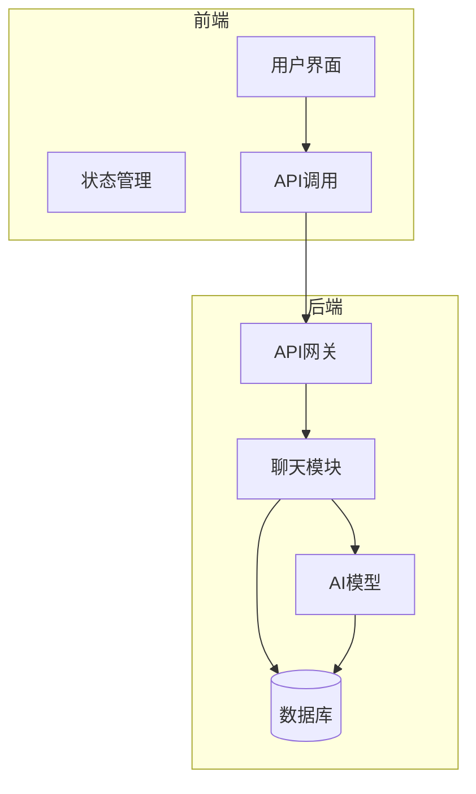
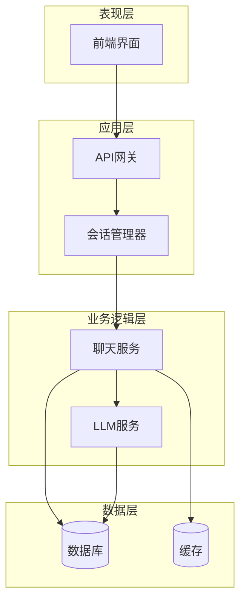
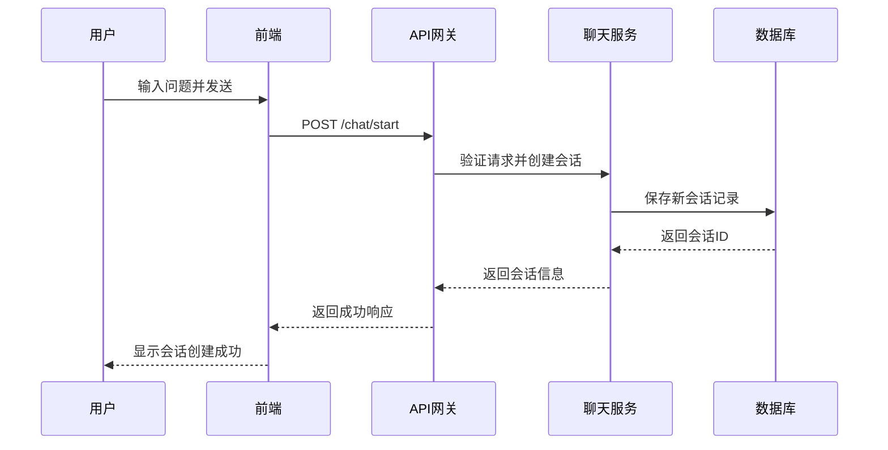
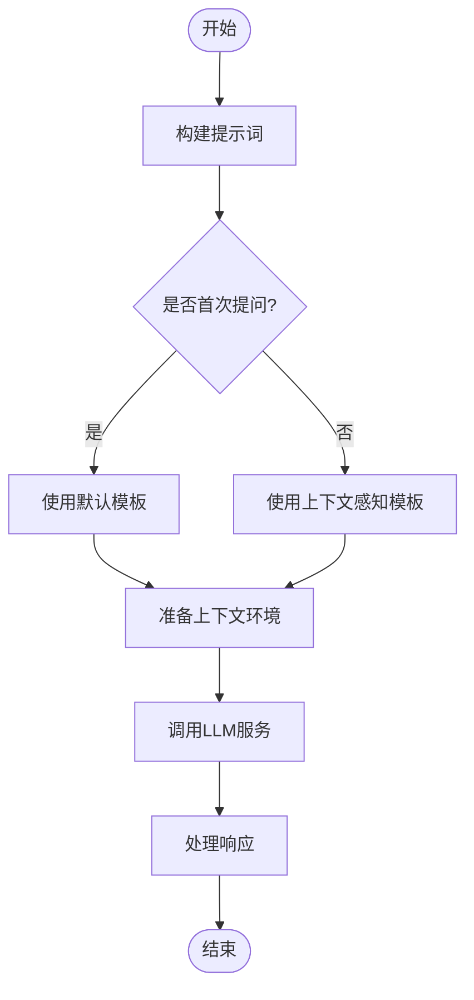
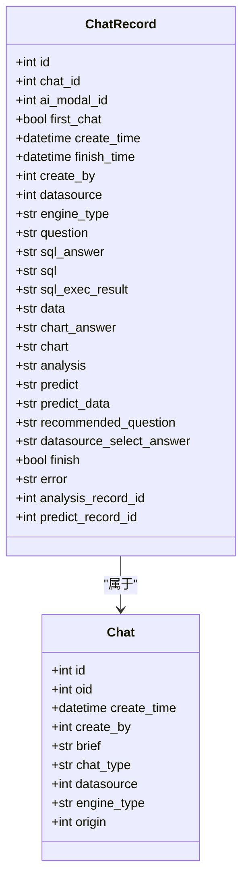
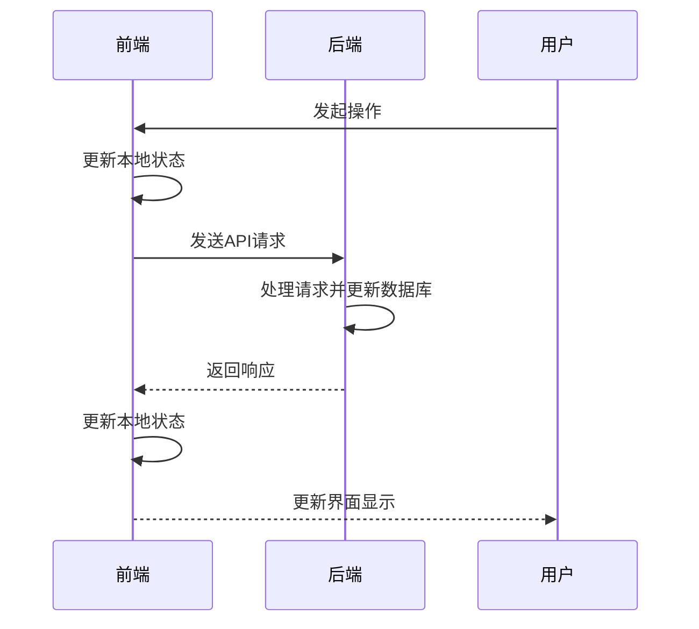
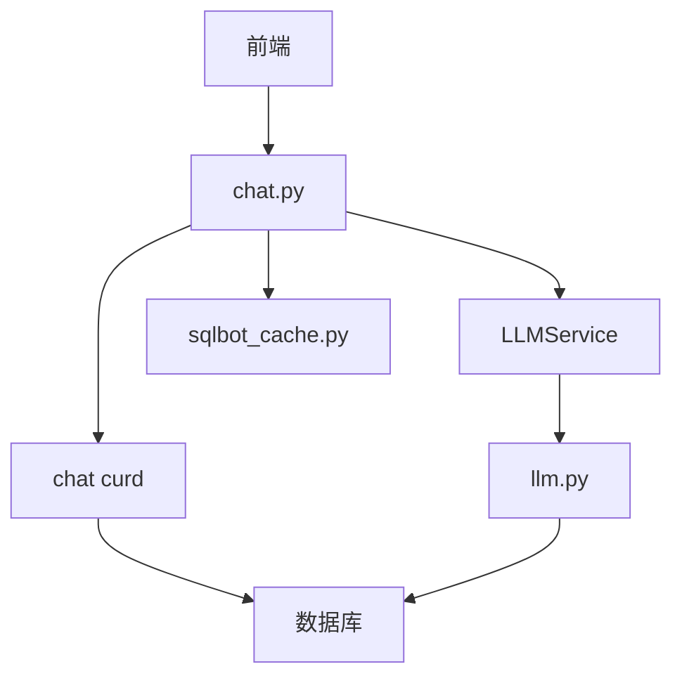
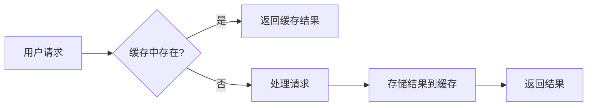

# 问题处理流程

<cite>
**本文档引用的文件**
- [chat.py](file://backend/apps/chat/api/chat.py)
- [chat_model.py](file://backend/apps/chat/models/chat_model.py)
- [llm.py](file://backend/apps/ai_model/openai/llm.py)
- [user.ts](file://frontend/src/stores/user.ts)
- [sqlbot_cache.py](file://backend/common/core/sqlbot_cache.py)
</cite>

## 目录
1. [简介](#简介)
2. [项目结构](#项目结构)
3. [核心组件](#核心组件)
4. [架构概述](#架构概述)
5. [详细组件分析](#详细组件分析)
6. [依赖分析](#依赖分析)
7. [性能考虑](#性能考虑)
8. [故障排除指南](#故障排除指南)
9. [结论](#结论)

## 简介
本文档详细阐述了SQLBot系统中自然语言问题处理的完整流程。从用户在前端输入问题开始，到后端API处理、会话状态管理、LLM上下文准备，再到最终结果返回的全过程。重点分析了chat.py中聊天会话的初始化逻辑、llm.py中LLM调用的上下文环境准备，以及chat_model.py中ChatRecord模型的first_chat字段在会话管理中的作用。同时探讨了前后端在会话状态同步方面的交互机制、异常处理策略和性能优化方案。

## 项目结构
SQLBot项目采用前后端分离架构，后端基于FastAPI框架实现，前端使用Vue.js构建。项目主要分为backend和frontend两个目录，其中backend包含核心业务逻辑、数据模型和API接口，frontend包含用户界面组件和状态管理。

**图示来源**
- [chat.py](file://backend/apps/chat/api/chat.py)
- [user.ts](file://frontend/src/stores/user.ts)

**本节来源**
- [chat.py](file://backend/apps/chat/api/chat.py)
- [user.ts](file://frontend/src/stores/user.ts)

## 核心组件
系统的核心组件包括聊天API接口、聊天记录模型、LLM服务和会话状态管理。这些组件协同工作，实现了从用户提问到智能回答的完整流程。聊天API负责接收和验证用户请求，聊天记录模型定义了会话数据结构，LLM服务处理自然语言理解和生成，会话状态管理确保了用户交互的连续性。

**本节来源**
- [chat.py](file://backend/apps/chat/api/chat.py)
- [chat_model.py](file://backend/apps/chat/models/chat_model.py)
- [llm.py](file://backend/apps/ai_model/openai/llm.py)

## 架构概述
系统采用分层架构设计，从前端用户界面到后端数据存储，各层职责分明。前端负责用户交互和界面展示，通过API与后端通信。后端API层处理请求验证和路由，业务逻辑层实现核心功能，数据访问层负责与数据库交互。这种架构设计提高了系统的可维护性和可扩展性。

**图示来源**
- [chat.py](file://backend/apps/chat/api/chat.py)
- [chat_model.py](file://backend/apps/chat/models/chat_model.py)
- [sqlbot_cache.py](file://backend/common/core/sqlbot_cache.py)

## 详细组件分析

### 聊天会话初始化分析
当用户发起新的聊天会话时，系统通过chat.py中的start_chat接口处理请求。该接口接收CreateChat对象作为参数，包含会话的初始问题、数据源等信息。系统首先验证用户身份，然后创建新的聊天记录，初始化会话状态。

**图示来源**
- [chat.py](file://backend/apps/chat/api/chat.py)
- [chat_model.py](file://backend/apps/chat/models/chat_model.py)

**本节来源**
- [chat.py](file://backend/apps/chat/api/chat.py#L180-L200)
- [chat_model.py](file://backend/apps/chat/models/chat_model.py#L150-L160)

### LLM上下文准备分析
llm.py中的BaseChatOpenAI类负责准备LLM调用的上下文环境。该类继承自ChatOpenAI，扩展了流式响应处理和使用量统计功能。当需要调用LLM时，系统会根据不同的操作类型（生成SQL、生成图表等）构建相应的系统提示和用户提示。

**图示来源**
- [llm.py](file://backend/apps/ai_model/openai/llm.py)
- [chat_model.py](file://backend/apps/chat/models/chat_model.py)

**本节来源**
- [llm.py](file://backend/apps/ai_model/openai/llm.py#L50-L100)
- [chat_model.py](file://backend/apps/chat/models/chat_model.py#L200-L220)

### 聊天记录模型分析
ChatRecord模型在chat_model.py中定义，是会话管理的核心数据结构。其中first_chat字段用于标识是否为会话中的首次提问，这对系统行为有重要影响。首次提问时，系统可能需要执行额外的初始化操作，如选择数据源、确定分析目标等。

**图示来源**
- [chat_model.py](file://backend/apps/chat/models/chat_model.py)
- [chat.py](file://backend/apps/chat/api/chat.py)

**本节来源**
- [chat_model.py](file://backend/apps/chat/models/chat_model.py#L80-L150)

### 前后端状态同步分析
前后端通过REST API和状态管理机制实现会话状态同步。前端使用Pinia进行状态管理，将用户会话信息存储在localStorage中。当用户进行操作时，前端更新本地状态并发送请求到后端，后端处理完成后返回最新状态，前端再更新本地状态。

**图示来源**
- [user.ts](file://frontend/src/stores/user.ts)
- [chat.py](file://backend/apps/chat/api/chat.py)

**本节来源**
- [user.ts](file://frontend/src/stores/user.ts#L0-L100)
- [chat.py](file://backend/apps/chat/api/chat.py#L50-L100)

## 依赖分析
系统各组件之间存在明确的依赖关系。前端依赖后端API提供数据和服务，后端API依赖业务逻辑组件和数据访问层。通过依赖注入机制，系统实现了组件间的松耦合，提高了代码的可测试性和可维护性。

**图示来源**
- [chat.py](file://backend/apps/chat/api/chat.py)
- [llm.py](file://backend/apps/ai_model/openai/llm.py)
- [sqlbot_cache.py](file://backend/common/core/sqlbot_cache.py)

**本节来源**
- [chat.py](file://backend/apps/chat/api/chat.py)
- [llm.py](file://backend/apps/ai_model/openai/llm.py)
- [sqlbot_cache.py](file://backend/common/core/sqlbot_cache.py)

## 性能考虑
系统在性能方面进行了多方面的优化。通过缓存机制减少重复计算，使用异步处理提高响应速度，采用流式响应避免长时间等待。特别是sqlbot_cache.py中实现的缓存系统，支持内存和Redis两种存储方式，可根据部署环境灵活配置。

**图示来源**
- [sqlbot_cache.py](file://backend/common/core/sqlbot_cache.py)
- [chat.py](file://backend/apps/chat/api/chat.py)

**本节来源**
- [sqlbot_cache.py](file://backend/common/core/sqlbot_cache.py#L0-L140)

## 故障排除指南
系统实现了完善的异常处理机制。在API层捕获异常并返回标准化的错误响应，便于前端处理。对于输入验证失败的情况，系统会返回具体的错误信息，帮助用户修正输入。同时，系统记录详细的日志，便于问题排查和分析。

**本节来源**
- [chat.py](file://backend/apps/chat/api/chat.py#L20-L40)
- [user.ts](file://frontend/src/stores/user.ts#L100-L150)

## 结论
SQLBot系统通过精心设计的架构和组件协作，实现了高效的自然语言问题处理流程。从前端用户交互到后端智能处理，各环节紧密配合，为用户提供流畅的问答体验。系统的模块化设计和清晰的依赖关系，使其具有良好的可维护性和可扩展性，为未来的功能增强奠定了坚实基础。