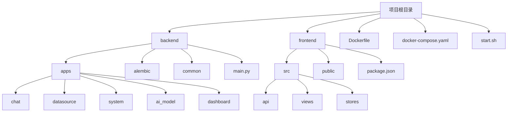
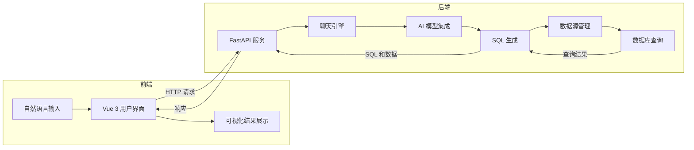
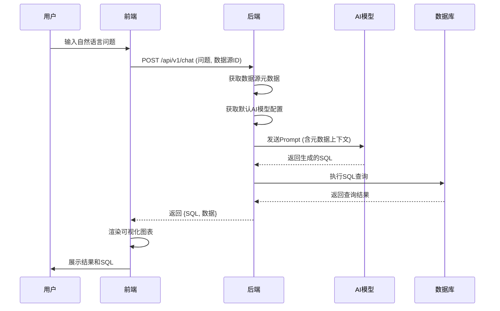
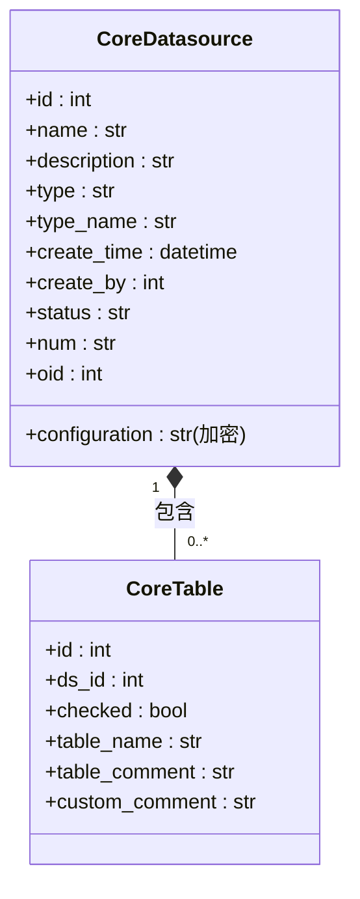
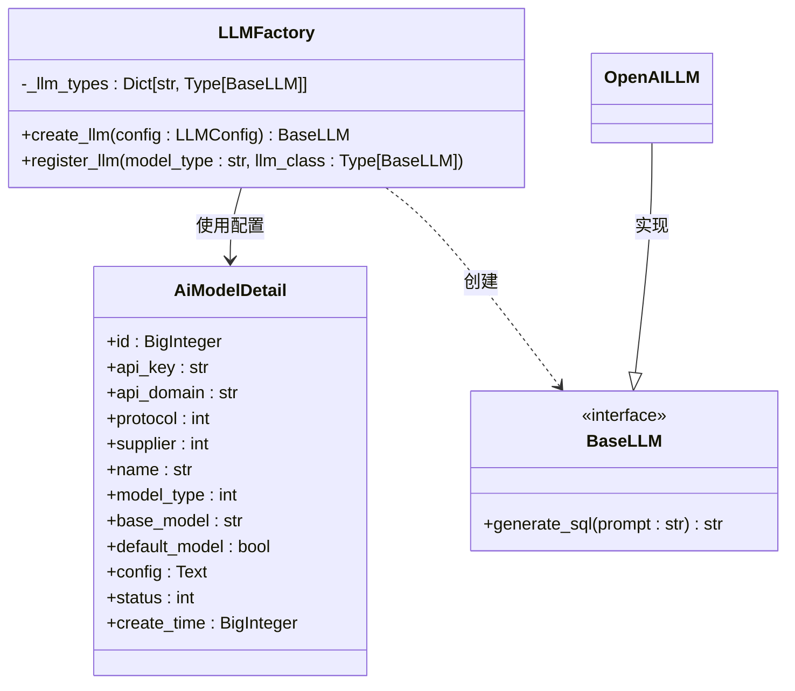
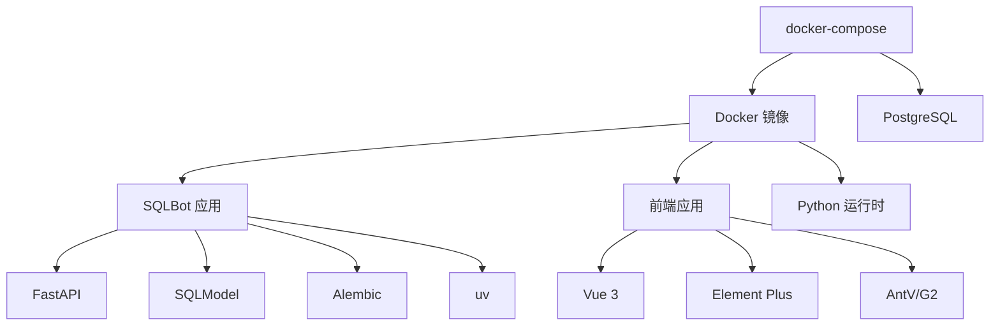

# 系统概述

<cite>
**本文档引用文件**  
- [main.py](file://backend/main.py)
- [Dockerfile](file://Dockerfile)
- [docker-compose.yaml](file://docker-compose.yaml)
- [start.sh](file://start.sh)
- [package.json](file://frontend/package.json)
</cite>

## 目录
1. [简介](#简介)
2. [项目结构](#项目结构)
3. [核心组件](#核心组件)
4. [架构概览](#架构概览)
5. [详细组件分析](#详细组件分析)
6. [依赖分析](#依赖分析)
7. [性能考虑](#性能考虑)
8. [故障排除指南](#故障排除指南)
9. [结论](#结论)

## 简介
SQLBot 是一个基于大语言模型（LLM）和检索增强生成（RAG）技术的智能问数系统，旨在让非技术人员通过自然语言查询数据库并获得可视化结果。系统采用前后端分离架构，后端使用 FastAPI 框架提供 RESTful API 服务，前端采用 Vue 3 构建现代化用户界面。其核心设计理念是开箱即用、易于集成和安全可控，能够快速连接多种数据源，将用户输入的自然语言问题转化为精确的 SQL 查询，并将执行结果以图表形式直观展示。

## 项目结构
SQLBot 项目采用清晰的模块化结构，主要分为 `backend` 和 `frontend` 两大目录，分别存放后端和前端代码。后端基于 Python 和 FastAPI，前端基于 TypeScript 和 Vue 3。

**Diagram sources**
- [Dockerfile](file://Dockerfile#L0-L71)
- [docker-compose.yaml](file://docker-compose.yaml#L0-L58)
- [start.sh](file://start.sh#L0-L8)

**Section sources**
- [Dockerfile](file://Dockerfile#L0-L71)
- [docker-compose.yaml](file://docker-compose.yaml#L0-L58)
- [start.sh](file://start.sh#L0-L8)

## 核心组件
SQLBot 的核心功能由多个关键组件协同实现。后端 `apps` 目录下的模块分别负责聊天引擎、数据源管理、AI 模型集成和仪表板功能。`main.py` 是 FastAPI 应用的入口点，负责初始化数据库迁移、缓存系统和路由。前端 `src` 目录下的 `views` 和 `stores` 实现了用户交互界面和状态管理。系统通过 `alembic` 进行数据库版本控制，确保数据结构的演进。

**Section sources**
- [main.py](file://backend/main.py#L0-L99)
- [package.json](file://frontend/package.json#L0-L74)

## 架构概览
SQLBot 采用典型的前后端分离架构。前端 Vue 3 应用通过 HTTP 请求与后端 FastAPI 服务进行通信。后端服务处理业务逻辑，包括接收用户问题、调用 AI 模型、生成 SQL、执行查询和返回结果。AI 模型管理模块允许用户配置和管理不同的 LLM 供应商（如 OpenAI、通义千问）。数据源管理模块负责连接和管理各种数据库。整个系统被容器化，通过 Docker 和 docker-compose 进行部署。

**Diagram sources**
- [main.py](file://backend/main.py#L0-L99)
- [package.json](file://frontend/package.json#L0-L74)

## 详细组件分析

### 聊天引擎与数据流分析
当用户在前端输入一个自然语言问题（如“上个月销售额最高的产品是什么？”）并提交后，前端会向后端 `/api/v1/chat` 接口发起请求。后端的聊天引擎接收到请求后，会从数据库中获取当前用户配置的数据源信息和系统中设置的默认 AI 模型。系统利用 RAG 技术，结合数据库的元数据（表结构、字段描述）作为上下文，调用 AI 模型 API。AI 模型根据上下文理解用户意图，并生成相应的 SQL 语句。生成的 SQL 随后被发送到数据源管理模块进行安全校验和执行。查询结果返回后，后端将原始数据和生成的 SQL 一并返回给前端，前端负责将数据渲染成图表。

**Diagram sources**
- [main.py](file://backend/main.py#L0-L99)
- [backend/apps/chat/curd/chat.py](file://backend/apps/chat/curd/chat.py#L287-L328)
- [frontend/src/api/chat.ts](file://frontend/src/api/chat.ts#L172-L226)

**Section sources**
- [backend/apps/chat/curd/chat.py](file://backend/apps/chat/curd/chat.py#L287-L328)
- [frontend/src/api/chat.ts](file://frontend/src/api/chat.ts#L172-L226)

### 数据源管理分析
数据源管理是 SQLBot 的基础。用户可以在系统中添加多种类型的数据源，如 PostgreSQL、MySQL 或 Excel 文件。相关数据模型定义在 `CoreDatasource` 中，包含名称、类型、加密的连接配置等字段。系统通过 `alembic` 的数据库迁移脚本（如 `003_add_datasource.py`）来创建和更新 `core_datasource` 表。后端的 `datasource` CRUD 模块提供了创建、读取、更新和删除数据源的完整 API。当用户选择一个数据源进行提问时，系统会使用其配置建立数据库连接。

**Diagram sources**
- [backend/apps/datasource/models/datasource.py](file://backend/apps/datasource/models/datasource.py#L0-L30)
- [backend/alembic/versions/003_add_datasource.py](file://backend/alembic/versions/003_add_datasource.py#L0-L38)

**Section sources**
- [backend/apps/datasource/models/datasource.py](file://backend/apps/datasource/models/datasource.py#L0-L30)
- [backend/apps/datasource/crud/datasource.py](file://backend/apps/datasource/crud/datasource.py#L0-L130)

### AI模型集成分析
AI 模型是 SQLBot 的智能核心。系统允许用户在 `system/aimodel` 模块中配置多个 AI 模型实例，并指定一个为默认模型。数据模型 `AiModelDetail` 存储了模型的名称、供应商、API 密钥、端点等信息。`model_factory.py` 中的 `LLMFactory` 类负责根据配置创建对应的 LLM 客户端实例。当聊天引擎需要生成 SQL 时，它会调用工厂方法获取一个 LLM 实例，并传入用户问题和数据库上下文。

**Diagram sources**
- [backend/apps/system/models/system_model.py](file://backend/apps/system/models/system_model.py#L0-L27)
- [backend/apps/ai_model/model_factory.py](file://backend/apps/ai_model/model_factory.py#L88-L126)
- [backend/apps/system/api/aimodel.py](file://backend/apps/system/api/aimodel.py#L70-L153)

**Section sources**
- [backend/apps/system/models/system_model.py](file://backend/apps/system/models/system_model.py#L0-L27)
- [backend/apps/ai_model/model_factory.py](file://backend/apps/ai_model/model_factory.py#L88-L126)

## 依赖分析
SQLBot 的依赖关系清晰。后端依赖于 FastAPI、SQLModel、Alembic 等 Python 库，通过 `pyproject.toml` 管理。前端依赖于 Vue 3、Element Plus、AntV/G2 等 JavaScript 库，通过 `package.json` 管理。整个应用的部署依赖于 Docker，`Dockerfile` 定义了构建镜像的步骤，`docker-compose.yaml` 定义了服务编排，将 SQLBot 应用与 PostgreSQL 数据库等其他服务一起启动。

**Diagram sources**
- [Dockerfile](file://Dockerfile#L0-L71)
- [docker-compose.yaml](file://docker-compose.yaml#L0-L58)
- [package.json](file://frontend/package.json#L0-L74)

**Section sources**
- [Dockerfile](file://Dockerfile#L0-L71)
- [docker-compose.yaml](file://docker-compose.yaml#L0-L58)
- [package.json](file://frontend/package.json#L0-L74)

## 性能考虑
系统的性能关键点在于 AI 模型的响应速度和数据库查询效率。后端通过 `FastAPICache` 实现了缓存机制，根据配置可使用内存或 Redis 缓存，有效减少对 AI 模型的重复调用。`init_sqlbot_cache()` 函数在应用启动时根据 `settings.CACHE_TYPE` 初始化相应的缓存后端。对于复杂的查询，前端使用 G2 图表库进行服务端渲染（SSR），减轻浏览器负担。

**Section sources**
- [backend/common/core/sqlbot_cache.py](file://backend/common/core/sqlbot_cache.py#L124-L139)

## 故障排除指南
常见问题包括数据源连接失败和 AI 模型调用超时。检查数据源配置的正确性，确保网络可达。确认 AI 模型的 API 密钥和端点配置无误。查看应用日志（位于 `/opt/sqlbot/logs`）以获取详细错误信息。确保 `docker-compose.yaml` 中的环境变量（如数据库连接信息）配置正确，并且 `sqlbot-db` 服务健康。

**Section sources**
- [main.py](file://backend/main.py#L30-L42)
- [docker-compose.yaml](file://docker-compose.yaml#L0-L58)

## 结论
SQLBot 是一个功能完备的智能问数系统，通过结合 LLM 和 RAG 技术，极大地降低了数据分析的门槛。其前后端分离的架构、模块化的设计以及容器化的部署方式，使其具备良好的可维护性和可扩展性。系统开箱即用的特性允许用户快速上手，而安全可控的设计则保障了数据访问的合规性。未来可进一步优化 SQL 生成的准确性和支持更复杂的数据分析场景。